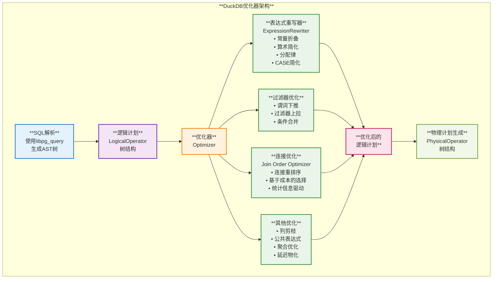
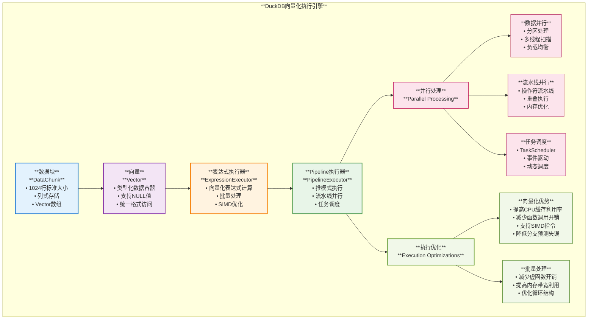
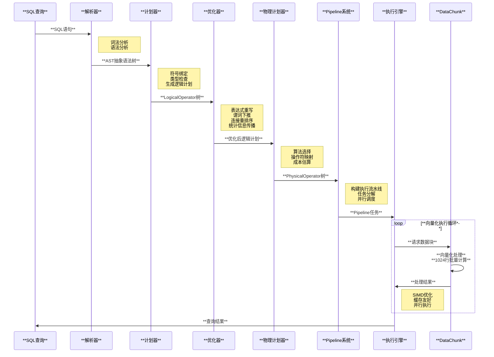

# **DuckDB 优化器架构与向量化执行引擎深度分析**

## **概述**

DuckDB 是一个高性能的嵌入式分析型数据库，采用现代化的查询优化和向量化执行技术。本报告基于对 DuckDB 源代码的深入分析，全面阐述了其优化器架构、算子类型、实现原理以及向量化执行引擎的核心技术。

---

## **1. DuckDB 优化器架构**

DuckDB 的优化器采用多阶段优化策略，结合规则优化（Rule-based Optimization, RBO）和基于成本的优化（Cost-based Optimization, CBO），实现高效的查询执行计划生成。



### **1.1 优化器类型与规则**

**源码位置**: `src/optimizer/optimizer.cpp`, `src/include/duckdb/common/enums/optimizer_type.hpp`

DuckDB 实现了 **46种优化器类型**，涵盖各个查询优化层面：

#### **表达式优化规则**
- **常量折叠** (`ConstantFoldingRule`)：编译时计算常量表达式
- **算术简化** (`ArithmeticSimplificationRule`)：简化数学运算
- **分配律** (`DistributivityRule`)：应用分配律优化
- **CASE简化** (`CaseSimplificationRule`)：优化条件表达式
- **比较简化** (`ComparisonSimplificationRule`)：优化比较操作

#### **核心查询优化器**
1. **FILTER_PUSHDOWN**: 谓词下推，将过滤条件尽可能推到数据源附近
2. **FILTER_PULLUP**: 过滤器上拉，提取公共过滤条件
3. **JOIN_ORDER**: 连接重排序，基于统计信息选择最优连接顺序
4. **STATISTICS_PROPAGATION**: 统计信息传播，维护查询计划的统计估算
5. **UNUSED_COLUMNS**: 列剪枝，只读取查询需要的列
6. **COMMON_SUBEXPRESSIONS**: 公共子表达式消除
7. **LIMIT_PUSHDOWN**: LIMIT下推，减少不必要的数据处理
8. **TOP_N**: Top-N优化，优化ORDER BY + LIMIT查询
9. **LATE_MATERIALIZATION**: 延迟物化，推迟列的读取时机

### **1.2 基于成本的优化（CBO）实现**

**核心组件**:
- **统计信息收集**: 自动收集列统计信息、直方图和基数估计
- **成本模型**: 基于数据分布和硬件特性的成本估算
- **连接算法选择**: 根据数据大小选择哈希连接、嵌套循环连接等
- **表达式成本评估**: `ExpressionHeuristics` 类实现表达式成本计算

**关键特性**:
- 支持多种连接算法的成本比较
- 动态调整优化策略
- 基于运行时反馈的适应性优化

---

## **2. 物理算子类型与实现**

DuckDB 实现了丰富的物理算子类型，覆盖了分析型查询的各种操作模式。

```mermaid
graph TD
    subgraph "**DuckDB物理算子类型**"
        A["**扫描算子**<br/>**Scan Operators**"]
        B["**投影与过滤**<br/>**Projection & Filter**"]
        C["**连接算子**<br/>**Join Operators**"]
        D["**聚合算子**<br/>**Aggregate Operators**"]
        E["**排序与限制**<br/>**Sort & Limit**"]
        F["**持久化算子**<br/>**Persistence Operators**"]
        
        A --> A1["**TABLE_SCAN**<br/>表扫描"]
        A --> A2["**DUMMY_SCAN**<br/>虚拟扫描"]
        A --> A3["**EXPRESSION_SCAN**<br/>表达式扫描"]
        A --> A4["**COLUMN_DATA_SCAN**<br/>列数据扫描"]
        
        B --> B1["**PROJECTION**<br/>投影操作"]
        B --> B2["**FILTER**<br/>过滤操作"]
        B --> B3["**UNNEST**<br/>展开操作"]
        
        C --> C1["**HASH_JOIN**<br/>哈希连接"]
        C --> C2["**NESTED_LOOP_JOIN**<br/>嵌套循环连接"]
        C --> C3["**PIECEWISE_MERGE_JOIN**<br/>分段归并连接"]
        C --> C4["**CROSS_PRODUCT**<br/>笛卡尔积"]
        
        D --> D1["**HASH_GROUP_BY**<br/>哈希分组聚合"]
        D --> D2["**UNGROUPED_AGGREGATE**<br/>无分组聚合"]
        D --> D3["**WINDOW**<br/>窗口函数"]
        D --> D4["**PERFECT_HASH_GROUP_BY**<br/>完美哈希聚合"]
        
        E --> E1["**ORDER_BY**<br/>排序"]
        E --> E2["**LIMIT**<br/>限制条数"]
        E --> E3["**TOP_N**<br/>Top-N排序"]
        E --> E4["**STREAMING_LIMIT**<br/>流式限制"]
        
        F --> F1["**INSERT**<br/>插入操作"]
        F --> F2["**UPDATE**<br/>更新操作"]
        F --> F3["**DELETE_OPERATOR**<br/>删除操作"]
        F --> F4["**COPY_TO_FILE**<br/>导出文件"]
    end
    
    style A fill:#e3f2fd,stroke:#1976d2,stroke-width:2px
    style B fill:#f3e5f5,stroke:#7b1fa2,stroke-width:2px
    style C fill:#fff3e0,stroke:#f57c00,stroke-width:2px
    style D fill:#e8f5e8,stroke:#388e3c,stroke-width:2px
    style E fill:#fce4ec,stroke:#c2185b,stroke-width:2px
    style F fill:#f1f8e9,stroke:#689f38,stroke-width:2px
    
    style A1 fill:#e3f2fd,stroke:#1565c0,stroke-width:1px
    style A2 fill:#e3f2fd,stroke:#1565c0,stroke-width:1px
    style A3 fill:#e3f2fd,stroke:#1565c0,stroke-width:1px
    style A4 fill:#e3f2fd,stroke:#1565c0,stroke-width:1px
    
    style B1 fill:#f3e5f5,stroke:#6a1b9a,stroke-width:1px
    style B2 fill:#f3e5f5,stroke:#6a1b9a,stroke-width:1px
    style B3 fill:#f3e5f5,stroke:#6a1b9a,stroke-width:1px
    
    style C1 fill:#fff3e0,stroke:#ef6c00,stroke-width:1px
    style C2 fill:#fff3e0,stroke:#ef6c00,stroke-width:1px
    style C3 fill:#fff3e0,stroke:#ef6c00,stroke-width:1px
    style C4 fill:#fff3e0,stroke:#ef6c00,stroke-width:1px
    
    style D1 fill:#e8f5e8,stroke:#2e7d32,stroke-width:1px
    style D2 fill:#e8f5e8,stroke:#2e7d32,stroke-width:1px
    style D3 fill:#e8f5e8,stroke:#2e7d32,stroke-width:1px
    style D4 fill:#e8f5e8,stroke:#2e7d32,stroke-width:1px
    
    style E1 fill:#fce4ec,stroke:#ad1457,stroke-width:1px
    style E2 fill:#fce4ec,stroke:#ad1457,stroke-width:1px
    style E3 fill:#fce4ec,stroke:#ad1457,stroke-width:1px
    style E4 fill:#fce4ec,stroke:#ad1457,stroke-width:1px
    
    style F1 fill:#f1f8e9,stroke:#558b2f,stroke-width:1px
    style F2 fill:#f1f8e9,stroke:#558b2f,stroke-width:1px
    style F3 fill:#f1f8e9,stroke:#558b2f,stroke-width:1px
    style F4 fill:#f1f8e9,stroke:#558b2f,stroke-width:1px
```



### **2.1 扫描算子实现**

**源码位置**: `src/execution/operator/scan/`

#### **TABLE_SCAN - 表扫描**
- **列式扫描优化**: 只读取查询需要的列
- **谓词下推**: 在扫描阶段应用过滤条件
- **并行扫描**: 支持多线程并行读取
- **统计信息利用**: 基于统计信息优化扫描策略

#### **EXPRESSION_SCAN - 表达式扫描**  
- **常量表达式生成**: VALUES子句的高效实现
- **向量化计算**: 批量生成表达式结果

### **2.2 连接算子实现**

**源码位置**: `src/execution/operator/join/`

#### **HASH_JOIN - 哈希连接**
- **构建阶段**: 较小表构建哈希表
- **探测阶段**: 较大表探测哈希表
- **向量化处理**: 批量哈希和探测操作
- **内存管理**: 支持溢出到磁盘的大数据连接

#### **NESTED_LOOP_JOIN - 嵌套循环连接**
- **适用场景**: 小表连接或没有连接条件的情况
- **向量化实现**: 批量处理减少循环开销

### **2.3 聚合算子实现**

**源码位置**: `src/execution/operator/aggregate/`

#### **HASH_GROUP_BY - 哈希分组聚合**
- **分组键哈希**: 高效的分组键管理
- **聚合函数向量化**: 批量聚合计算
- **内存优化**: 自适应内存分配和管理
- **多阶段聚合**: 支持部分聚合和最终聚合

#### **PERFECT_HASH_GROUP_BY - 完美哈希聚合**
- **适用场景**: 分组键基数较小且已知的情况
- **零冲突哈希**: 直接数组访问，性能优异

---

## **3. 向量化执行引擎**

DuckDB 的向量化执行引擎是其高性能的核心，通过批量处理和 SIMD 优化实现卓越的查询性能。



### **3.1 DataChunk - 数据块**

**源码位置**: `src/common/types/data_chunk.cpp`

**核心特性**:
- **标准大小**: 1024行标准批大小（STANDARD_VECTOR_SIZE）
- **列式存储**: 每个列作为一个 Vector 存储
- **内存管理**: 自动内存分配和缓存重用
- **序列化支持**: 支持数据块的序列化和反序列化

**关键方法**:
```cpp
// 初始化数据块
void Initialize(Allocator &allocator, const vector<LogicalType> &types, idx_t capacity);

// 向量化哈希计算
void Hash(Vector &result);

// 数据块切片
void Slice(const SelectionVector &sel_vector, idx_t count);

// 统一格式转换
unsafe_unique_array<UnifiedVectorFormat> ToUnifiedFormat();
```

### **3.2 Vector - 向量**

**核心特性**:
- **类型化存储**: 每个 Vector 存储特定类型的数据
- **NULL值处理**: 内置 ValidityMask 处理 NULL 值
- **多种向量类型**: FLAT_VECTOR, CONSTANT_VECTOR, DICTIONARY_VECTOR 等
- **统一访问接口**: UnifiedVectorFormat 提供统一的数据访问方式

### **3.3 ExpressionExecutor - 表达式执行器**

**源码位置**: `src/execution/expression_executor.cpp`

**核心功能**:
- **向量化表达式计算**: 批量计算表达式结果
- **选择向量优化**: 高效的条件过滤
- **状态管理**: 表达式执行状态的管理和缓存

**关键方法**:
```cpp
// 执行表达式并返回结果向量
void Execute(DataChunk *input, DataChunk &result);

// 选择性执行，返回满足条件的行数
idx_t SelectExpression(DataChunk &input, SelectionVector &sel);
```

### **3.4 Pipeline 执行模型**

**源码位置**: `src/parallel/pipeline_executor.cpp`, `src/parallel/pipeline.cpp`

**执行模式**: 推模式（Push-based）
- 数据从叶子节点（数据源）向根节点（结果收集器）流动
- 每个操作符处理完数据后推送给下游操作符
- 减少数据物化，提高内存效率

**并行策略**:
1. **数据并行**: 相同操作符处理不同数据分区
2. **流水线并行**: 不同操作符并行执行
3. **任务调度**: 动态任务调度和负载均衡

**关键特性**:
- **事件驱动**: 基于事件的任务协调
- **中断处理**: 支持查询中断和取消
- **内存管理**: 自适应内存分配和管理

---

## **4. 查询执行流程**



### **4.1 解析与绑定阶段**
1. **SQL解析**: 使用 libpg_query 将 SQL 字符串转换为 AST
2. **符号绑定**: Binder 将表名、列名解析为实际的数据库对象
3. **类型检查**: 验证表达式类型兼容性
4. **逻辑计划生成**: 构建 LogicalOperator 树

### **4.2 优化阶段**
1. **表达式重写**: 应用各种表达式简化规则
2. **结构优化**: 谓词下推、连接重排序、列剪枝等
3. **统计信息利用**: 基于统计信息进行成本估算
4. **计划选择**: 选择最优的逻辑执行计划

### **4.3 执行阶段**
1. **物理计划生成**: 将逻辑计划转换为物理执行计划
2. **Pipeline构建**: 构建执行流水线，确定并行策略
3. **向量化执行**: 批量处理数据，应用 SIMD 优化
4. **结果收集**: 收集和返回查询结果

---

## **5. 核心技术优势**

### **5.1 向量化执行优势**
- **CPU缓存友好**: 批量处理提高缓存命中率
- **SIMD指令支持**: 充分利用现代CPU的并行计算能力
- **减少函数调用开销**: 批量操作减少虚函数调用
- **分支预测优化**: 减少条件分支，提高CPU流水线效率

### **5.2 优化器优势**
- **多层次优化**: 表达式级、操作符级、查询级全面优化
- **适应性强**: 基于统计信息和运行时反馈的动态优化
- **扩展性好**: 46种优化器类型，易于扩展新的优化规则
- **成本精确**: 先进的成本模型和统计信息收集

### **5.3 并行处理优势**
- **多级并行**: 支持数据并行和流水线并行
- **动态调度**: 智能的任务调度和负载均衡
- **资源优化**: 高效的内存管理和资源利用
- **扩展性**: 良好的多核扩展性能

---

## **6. 总结**

DuckDB 通过其先进的优化器架构和向量化执行引擎，实现了卓越的分析型查询性能：

### **架构优势**
1. **模块化设计**: 清晰的模块分离，易于维护和扩展
2. **全面优化**: 从表达式级到查询级的多层次优化
3. **向量化处理**: 现代化的批量处理模型
4. **并行友好**: 出色的多核性能扩展

### **性能特点**
1. **查询优化**: 46种优化规则确保生成高效执行计划
2. **执行效率**: 向量化和SIMD优化提供卓越的执行性能
3. **内存效率**: 推模式执行和智能缓存管理
4. **并发性能**: 多级并行和动态调度

### **技术创新**
1. **适应性优化**: 基于统计信息和运行时反馈的智能优化
2. **Pipeline执行**: 高效的流水线执行模型
3. **完整的向量化**: 从存储到计算的全链路向量化
4. **现代化架构**: 充分利用现代硬件特性

DuckDB 的设计充分体现了现代数据库系统的发展趋势，在保持简单易用的同时，通过先进的技术实现了优异的性能，为分析型工作负载提供了理想的解决方案。
