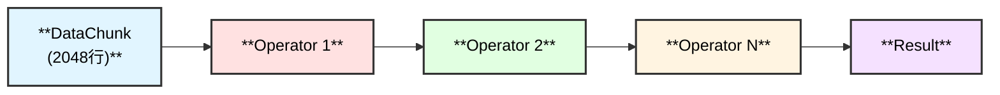
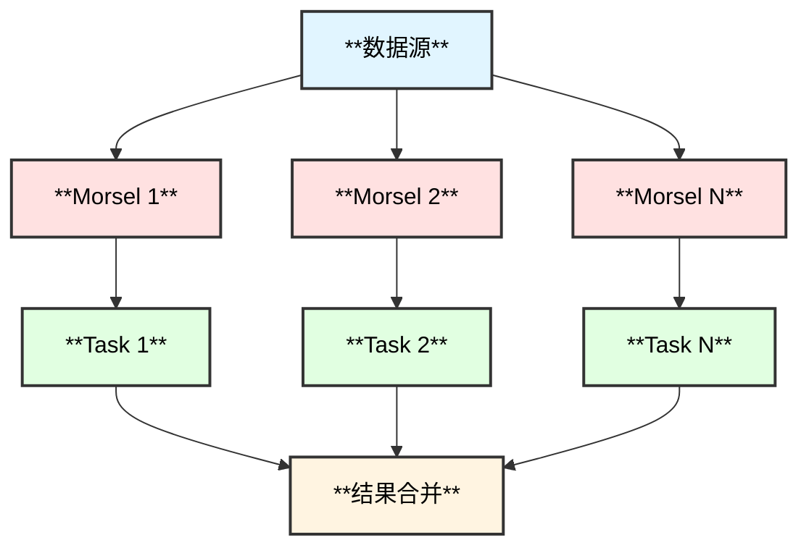
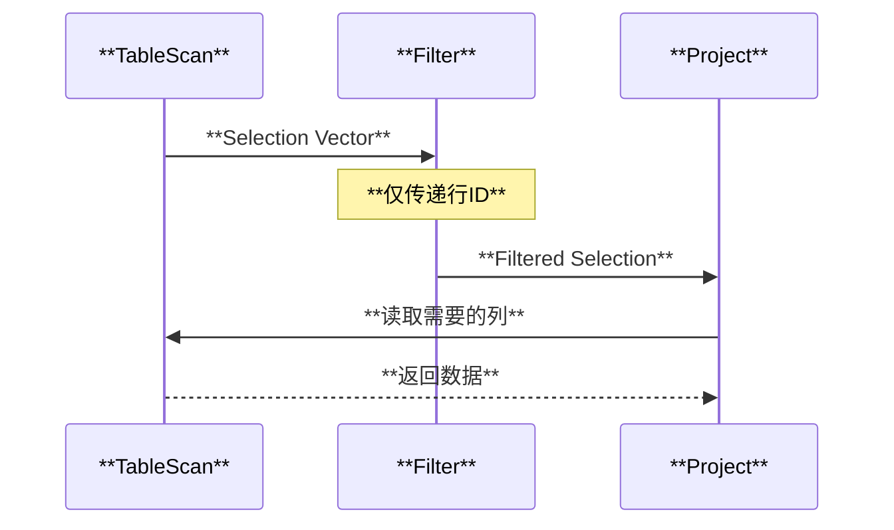

# DuckDB 计算层架构总览

## 概述

DuckDB 计算层是查询处理的核心，负责将 SQL 查询转换为可执行的物理计划并高效执行。计算层采用经典的火山模型和现代的向量化执行技术，结合 Pipeline 并行执行引擎，提供卓越的查询性能。

## 整体架构

```mermaid
graph TB
    subgraph "**查询处理流程**"
        A["**SQL Query**"]
        B["**Parser<br/>(语法解析)**"]
        C["**Binder<br/>(名称绑定)**"]
        D["**Planner<br/>(逻辑计划)**"]
        E["**Optimizer<br/>(计划优化)**"]
        F["**PhysicalPlanGenerator<br/>(物理计划)**"]
        G["**Pipeline Builder<br/>(Pipeline构建)**"]
        H["**Executor<br/>(并行执行)**"]
        I["**Result**"]
    end
    
    A --> B
    B --> C
    C --> D
    D --> E
    E --> F
    F --> G
    G --> H
    H --> I
    
    style A fill:#e1f5ff,stroke:#333,stroke-width:2px,color:#000
    style B fill:#ffe1e1,stroke:#333,stroke-width:2px,color:#000
    style C fill:#e1ffe1,stroke:#333,stroke-width:2px,color:#000
    style D fill:#fff4e1,stroke:#333,stroke-width:2px,color:#000
    style E fill:#f5e1ff,stroke:#333,stroke-width:2px,color:#000
    style F fill:#e1ffff,stroke:#333,stroke-width:2px,color:#000
    style G fill:#ffe1ff,stroke:#333,stroke-width:2px,color:#000
    style H fill:#ffffe1,stroke:#333,stroke-width:2px,color:#000
    style I fill:#e1e1ff,stroke:#333,stroke-width:2px,color:#000
```



## 模块详解

### 1. [Parser（解析器）](parser.md)

- **功能**：将 SQL 字符串转换为抽象语法树（AST）
- **核心组件**：
  - PostgresParser - 词法和语法分析
  - Transformer - AST 转换
  - Expression System - 表达式系统
  - Statement Types - 语句类型
- **输入**：SQL 查询字符串
- **输出**：SQLStatement（AST）

### 2. Transformer（转换器）

- **功能**：将 PostgreSQL Parse Tree 转换为 DuckDB AST
- **特点**：已集成在 Parser 中
- **详见**：[Parser 文档](parser.md)

### 3. [Planner & Binder（计划器和绑定器）](planner.md)

- **功能**：名称解析、类型检查、生成逻辑执行计划
- **核心组件**：
  - Binder - 名称绑定和类型检查
  - BindContext - 绑定上下文
  - LogicalOperator - 逻辑算子
- **输入**：SQLStatement
- **输出**：LogicalPlan

### 4. [Optimizer（优化器）](optimizer.md)

- **功能**：优化逻辑执行计划
- **主要优化**：
  - Filter Pushdown - 谓词下推
  - Projection Pushdown - 列裁剪
  - Join Reordering - 连接重排
  - Common Subexpression Elimination - 公共子表达式消除
- **输入**：LogicalPlan
- **输出**：Optimized LogicalPlan

### 5. [Executor & PhysicalPlanGenerator（执行器和物理计划生成器）](executor.md)

- **功能**：生成物理执行计划
- **核心组件**：
  - PhysicalPlanGenerator - 物理计划生成
  - PhysicalOperator - 物理算子
- **输入**：Optimized LogicalPlan
- **输出**：PhysicalPlan

### 6. [Pipeline 执行引擎](pipeline.md)

- **功能**：并行执行查询
- **核心概念**：
  - Pipeline - 算子管道
  - Event - 执行事件
  - Task - 执行任务
  - Parallel Execution - 并行执行
- **输入**：PhysicalPlan
- **输出**：QueryResult

## 关键技术

### 1. 向量化执行

DuckDB 使用向量化执行技术，每次处理一批数据（默认 2048 行）：



### 2. Morsel-Driven 并行

Pipeline 采用 Morsel-Driven 并行策略，将数据分成小块（morsel）并行处理：



### 3. 延迟物化

延迟物化（Late Materialization）延迟列数据的读取：



## 查询示例

```sql
SELECT 
    category, 
    COUNT(*) as count,
    AVG(price) as avg_price
FROM products
WHERE price > 100
GROUP BY category
HAVING COUNT(*) > 10
ORDER BY avg_price DESC
LIMIT 5;
```

### 执行流程

1. **Parser**: SQL → SelectStatement
2. **Binder**: 绑定表 `products`，解析列引用
3. **Planner**: 生成逻辑计划
   - LogicalGet(products)
   - LogicalFilter(price > 100)
   - LogicalAggregate(GROUP BY category)
   - LogicalFilter(COUNT(*) > 10)
   - LogicalOrder(avg_price DESC)
   - LogicalLimit(5)
4. **Optimizer**: 
   - Filter pushdown: 将 price > 100 下推到扫描
   - Projection pushdown: 仅读取需要的列
5. **PhysicalPlanGenerator**: 生成物理算子
   - PhysicalTableScan + Filter
   - PhysicalHashAggregate
   - PhysicalFilter
   - PhysicalSort
   - PhysicalLimit
6. **Pipeline**: 构建并行 Pipeline
7. **Executor**: 并行执行，返回结果

## 性能特点

| **特性** | **说明** | **优势** |
|---------|---------|---------|
| **向量化执行** | 批量处理数据 | CPU 缓存友好 |
| **Pipeline 并行** | 多线程执行 | 利用多核 CPU |
| **列式存储** | 按列组织数据 | 高压缩率、列裁剪 |
| **JIT 编译** | 运行时代码生成 | 消除虚函数开销 |
| **零拷贝** | 避免不必要的数据复制 | 降低内存带宽 |
| **自适应执行** | 运行时调整策略 | 适应数据分布 |

## 相关文档

- [Parser 模块](parser.md)
- [Planner & Binder 模块](planner.md)
- [Optimizer 模块](optimizer.md)
- [Executor 模块](executor.md)
- [Pipeline 执行引擎](pipeline.md)

## 相关源码目录

- `src/parser/` - Parser 实现
- `src/planner/` - Planner 和 Binder 实现
- `src/optimizer/` - Optimizer 实现
- `src/execution/` - Executor 和物理算子实现
- `src/parallel/` - Pipeline 执行引擎实现

