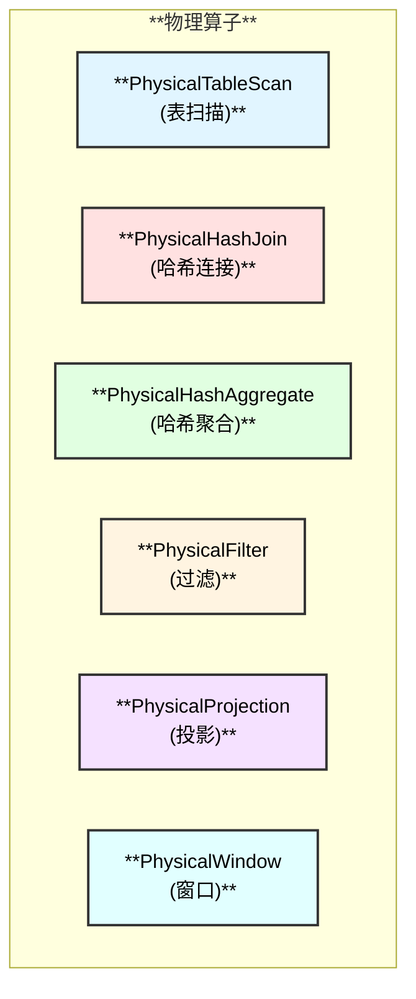

# DuckDB Executor 和 PhysicalPlanGenerator 模块

## 概述

Executor 和 PhysicalPlanGenerator 负责将优化后的逻辑计划转换为物理执行计划，并执行查询。

## 整体架构

```mermaid
graph TB
    subgraph "**执行架构**"
        A["**Optimized LogicalPlan**"]
        B["**PhysicalPlanGenerator**"]
        C["**PhysicalPlan**"]
        D["**Pipeline Builder**"]
        E["**Pipeline**"]
        F["**Executor**"]
        G["**Result**"]
    end
    
    A --> B
    B --> C
    C --> D
    D --> E
    E --> F
    F --> G
    
    style A fill:#e1f5ff,stroke:#333,stroke-width:2px,color:#000
    style B fill:#ffe1e1,stroke:#333,stroke-width:2px,color:#000
    style C fill:#e1ffe1,stroke:#333,stroke-width:2px,color:#000
    style D fill:#fff4e1,stroke:#333,stroke-width:2px,color:#000
    style E fill:#f5e1ff,stroke:#333,stroke-width:2px,color:#000
    style F fill:#e1ffff,stroke:#333,stroke-width:2px,color:#000
    style G fill:#ffe1ff,stroke:#333,stroke-width:2px,color:#000
```

## PhysicalOperator 类型

## 相关源码

- `src/execution/physical_plan_generator.cpp` - 物理计划生成器
- `src/execution/physical_operator.cpp` - 物理算子基类
- `src/execution/operator/` - 物理算子实现
- `src/execution/executor.cpp` - 执行器

