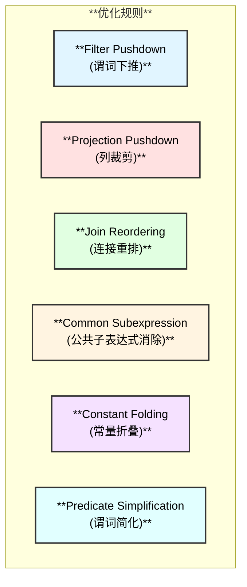

# DuckDB Optimizer 模块

## 概述

Optimizer（优化器）是 DuckDB 计算层的关键组件，负责将逻辑执行计划转换为更高效的执行计划。DuckDB 使用基于规则和启发式的优化策略，包含多个优化阶段。

## 整体架构

```mermaid
graph TB
    subgraph "**Optimizer架构**"
        A["**LogicalPlan<br/>(输入)**"]
        B["**Expression Rewriter**"]
        C["**Filter Pushdown**"]
        D["**Projection Pushdown**"]
        E["**Join Order Optimizer**"]
        F["**Common Subexpression**"]
        G["**Optimized Plan<br/>(输出)**"]
    end
    
    A --> B
    B --> C
    C --> D
    D --> E
    E --> F
    F --> G
    
    style A fill:#e1f5ff,stroke:#333,stroke-width:2px,color:#000
    style B fill:#ffe1e1,stroke:#333,stroke-width:2px,color:#000
    style C fill:#e1ffe1,stroke:#333,stroke-width:2px,color:#000
    style D fill:#fff4e1,stroke:#333,stroke-width:2px,color:#000
    style E fill:#f5e1ff,stroke:#333,stroke-width:2px,color:#000
    style F fill:#e1ffff,stroke:#333,stroke-width:2px,color:#000
    style G fill:#ffe1ff,stroke:#333,stroke-width:2px,color:#000
```

## 主要优化规则

## 相关源码

- `src/optimizer/optimizer.cpp` - 优化器主类
- `src/optimizer/filter_pushdown.cpp` - 谓词下推
- `src/optimizer/join_order/` - 连接顺序优化
- `src/optimizer/rule/` - 优化规则

