# DuckDB Parser 模块

## 概述

Parser（解析器）是 DuckDB 计算层的第一个阶段，负责将 SQL 查询字符串转换为抽象语法树（AST）。DuckDB 的 Parser 基于 PostgreSQL 的 libpg_query 库构建，支持完整的 SQL 语法，并提供了扩展机制允许第三方添加自定义语法支持。

## 整体架构

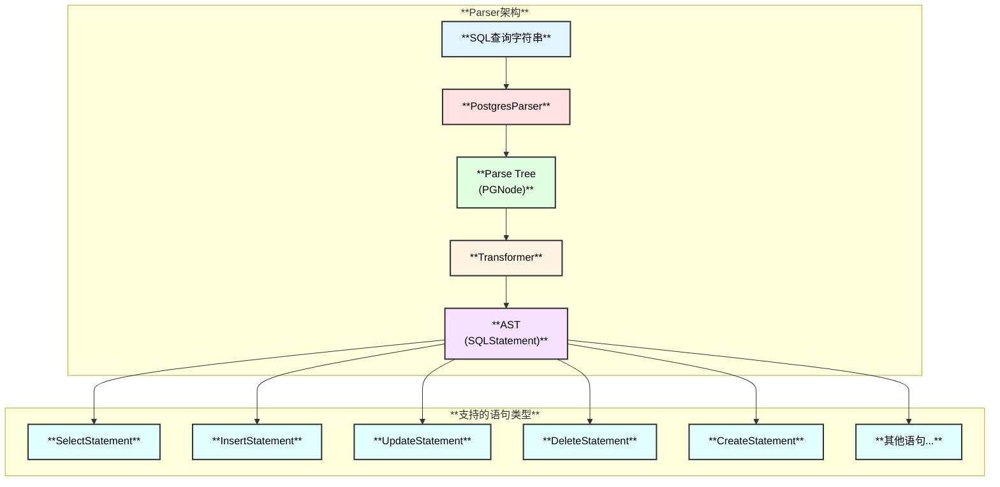

## 核心组件

### 1. Parser 类

Parser 类是解析器的入口点，负责协调整个解析过程。

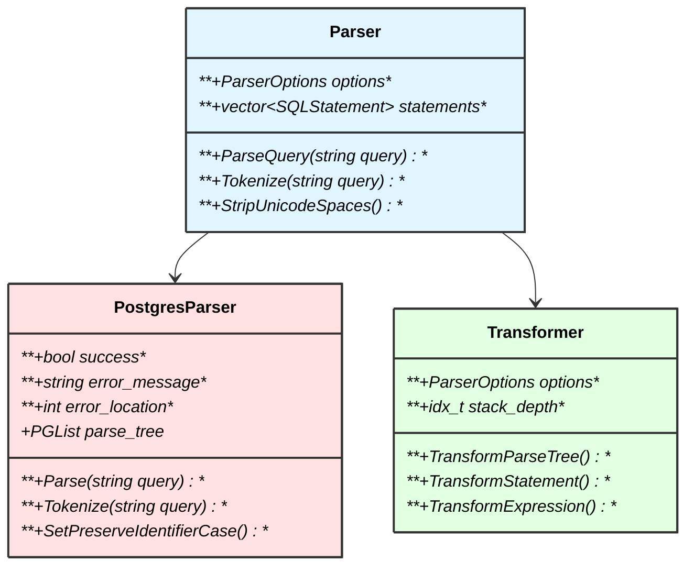

### 2. 解析流程

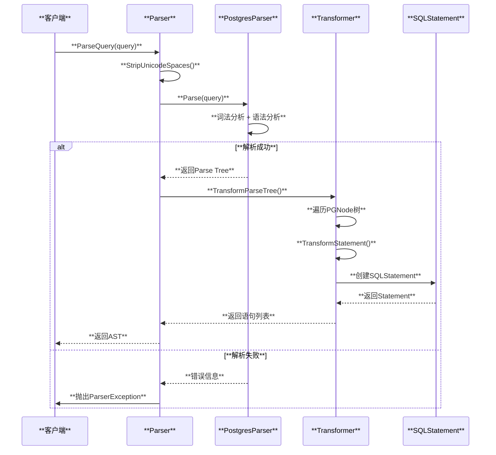

## SQL语句类型

DuckDB 支持各种 SQL 语句类型，每种类型都有对应的 Statement 类：

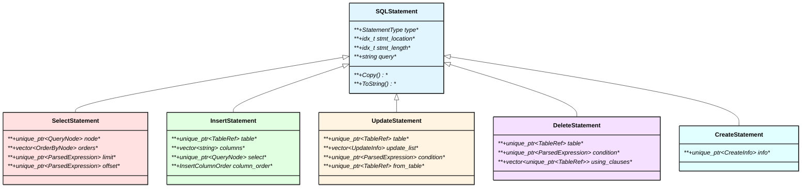

### 支持的语句类型列表

| **语句类型** | **说明** | **示例** |
|------------|---------|---------|
| **SELECT_STATEMENT** | 查询语句 | `SELECT * FROM users` |
| **INSERT_STATEMENT** | 插入语句 | `INSERT INTO users VALUES (1, 'Alice')` |
| **UPDATE_STATEMENT** | 更新语句 | `UPDATE users SET age = 30` |
| **DELETE_STATEMENT** | 删除语句 | `DELETE FROM users WHERE id = 1` |
| **CREATE_STATEMENT** | 创建对象 | `CREATE TABLE users (id INT)` |
| **DROP_STATEMENT** | 删除对象 | `DROP TABLE users` |
| **ALTER_STATEMENT** | 修改对象 | `ALTER TABLE users ADD COLUMN age INT` |
| **TRANSACTION_STATEMENT** | 事务控制 | `BEGIN`, `COMMIT`, `ROLLBACK` |
| **COPY_STATEMENT** | 数据导入导出 | `COPY users FROM 'data.csv'` |
| **EXPLAIN_STATEMENT** | 查询计划 | `EXPLAIN SELECT * FROM users` |
| **PREPARE_STATEMENT** | 准备语句 | `PREPARE stmt AS SELECT $1` |
| **EXECUTE_STATEMENT** | 执行语句 | `EXECUTE stmt(1)` |
| **PRAGMA_STATEMENT** | 系统设置 | `PRAGMA table_info('users')` |
| **VACUUM_STATEMENT** | 清理数据库 | `VACUUM` |
| **CALL_STATEMENT** | 调用函数 | `CALL my_function()` |

## 表达式系统

### 表达式类型

DuckDB 的表达式系统支持丰富的表达式类型：

```mermaid
classDiagram
    class ParsedExpression {
        **+ExpressionType type**
        **+ExpressionClass expression_class**
        **+string alias**
        **+Copy()**
        **+ToString()**
        **+Equals()**
    }
    
    class ColumnRefExpression {
        **+vector~string~ column_names**
        **+string table_name**
    }
    
    class ConstantExpression {
        **+Value value**
    }
    
    class FunctionExpression {
        **+string function_name**
        **+vector~ParsedExpression~ children**
        **+bool distinct**
        **+OrderModifier order_bys**
    }
    
    class ComparisonExpression {
        **+ExpressionType comparison_type**
        **+ParsedExpression left**
        **+ParsedExpression right**
    }
    
    class ConjunctionExpression {
        **+vector~ParsedExpression~ children**
    }
    
    class CastExpression {
        **+ParsedExpression child**
        **+LogicalType target_type**
    }
    
    class SubqueryExpression {
        **+QueryNode subquery**
        **+SubqueryType subquery_type**
    }
    
    class WindowExpression {
        **+vector~ParsedExpression~ partitions**
        **+vector~OrderByNode~ orders**
        **+WindowBoundary start**
        **+WindowBoundary end**
    }
    
    ParsedExpression <|-- ColumnRefExpression
    ParsedExpression <|-- ConstantExpression
    ParsedExpression <|-- FunctionExpression
    ParsedExpression <|-- ComparisonExpression
    ParsedExpression <|-- ConjunctionExpression
    ParsedExpression <|-- CastExpression
    ParsedExpression <|-- SubqueryExpression
    ParsedExpression <|-- WindowExpression
    
    style ParsedExpression fill:#e1f5ff,stroke:#333,stroke-width:2px,color:#000
    style ColumnRefExpression fill:#ffe1e1,stroke:#333,stroke-width:2px,color:#000
    style ConstantExpression fill:#e1ffe1,stroke:#333,stroke-width:2px,color:#000
    style FunctionExpression fill:#fff4e1,stroke:#333,stroke-width:2px,color:#000
    style ComparisonExpression fill:#f5e1ff,stroke:#333,stroke-width:2px,color:#000
    style ConjunctionExpression fill:#e1ffff,stroke:#333,stroke-width:2px,color:#000
    style CastExpression fill:#ffe1ff,stroke:#333,stroke-width:2px,color:#000
    style SubqueryExpression fill:#ffffe1,stroke:#333,stroke-width:2px,color:#000
    style WindowExpression fill:#e1e1ff,stroke:#333,stroke-width:2px,color:#000
```

### 表达式类型详解

| **表达式类型** | **说明** | **示例** |
|--------------|---------|---------|
| **ColumnRefExpression** | 列引用 | `users.name`, `age` |
| **ConstantExpression** | 常量值 | `42`, `'hello'`, `NULL` |
| **FunctionExpression** | 函数调用 | `SUM(price)`, `UPPER(name)` |
| **ComparisonExpression** | 比较运算 | `age > 18`, `name = 'Alice'` |
| **ConjunctionExpression** | 逻辑连接 | `age > 18 AND city = 'NY'` |
| **CastExpression** | 类型转换 | `CAST(age AS VARCHAR)` |
| **SubqueryExpression** | 子查询 | `(SELECT MAX(age) FROM users)` |
| **WindowExpression** | 窗口函数 | `ROW_NUMBER() OVER (...)` |
| **BetweenExpression** | 范围判断 | `age BETWEEN 18 AND 65` |
| **CaseExpression** | 条件表达式 | `CASE WHEN ... THEN ... END` |
| **LambdaExpression** | Lambda函数 | `x -> x + 1` |
| **OperatorExpression** | 算术运算 | `a + b`, `x * y` |
| **ParameterExpression** | 参数占位符 | `$1`, `$2` |

## Transformer 详解

Transformer 负责将 PostgreSQL 的 Parse Tree 转换为 DuckDB 的 AST。

### Transformer 架构

```mermaid
graph TB
    subgraph "**Transformer组件**"
        A["**Transformer**"]
        B["**Statement Transform**"]
        C["**Expression Transform**"]
        D["**TableRef Transform**"]
        E["**QueryNode Transform**"]
    end
    
    A --> B
    A --> C
    A --> D
    A --> E
    
    B --> F["**TransformSelect**"]
    B --> G["**TransformInsert**"]
    B --> H["**TransformUpdate**"]
    B --> I["**TransformCreate**"]
    
    C --> J["**TransformColumnRef**"]
    C --> K["**TransformConstant**"]
    C --> L["**TransformFunction**"]
    C --> M["**TransformOperator**"]
    
    D --> N["**TransformBaseTable**"]
    D --> O["**TransformJoin**"]
    D --> P["**TransformSubquery**"]
    
    style A fill:#e1f5ff,stroke:#333,stroke-width:2px,color:#000
    style B fill:#ffe1e1,stroke:#333,stroke-width:2px,color:#000
    style C fill:#e1ffe1,stroke:#333,stroke-width:2px,color:#000
    style D fill:#fff4e1,stroke:#333,stroke-width:2px,color:#000
    style E fill:#f5e1ff,stroke:#333,stroke-width:2px,color:#000
    style F fill:#e1ffff,stroke:#333,stroke-width:2px,color:#000
    style G fill:#e1ffff,stroke:#333,stroke-width:2px,color:#000
    style H fill:#e1ffff,stroke:#333,stroke-width:2px,color:#000
    style I fill:#e1ffff,stroke:#333,stroke-width:2px,color:#000
    style J fill:#ffe1ff,stroke:#333,stroke-width:2px,color:#000
    style K fill:#ffe1ff,stroke:#333,stroke-width:2px,color:#000
    style L fill:#ffe1ff,stroke:#333,stroke-width:2px,color:#000
    style M fill:#ffe1ff,stroke:#333,stroke-width:2px,color:#000
    style N fill:#ffffe1,stroke:#333,stroke-width:2px,color:#000
    style O fill:#ffffe1,stroke:#333,stroke-width:2px,color:#000
    style P fill:#ffffe1,stroke:#333,stroke-width:2px,color:#000
```

### Transformer 处理流程

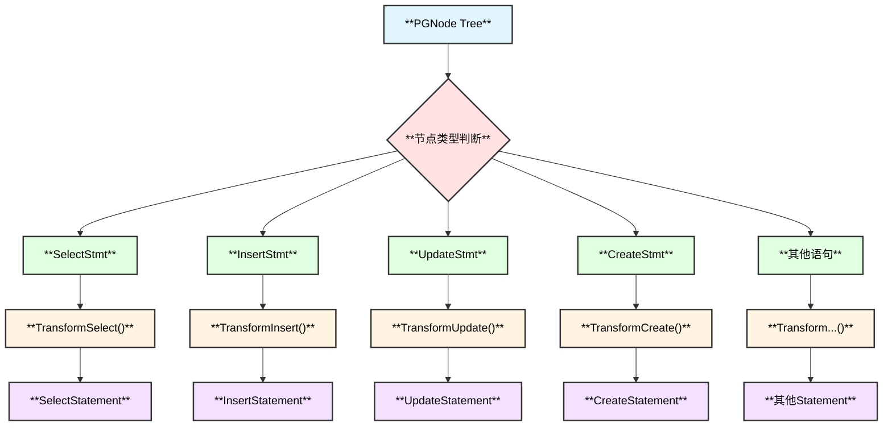

## QueryNode 系统

QueryNode 表示查询的逻辑结构，支持复杂的查询组合。

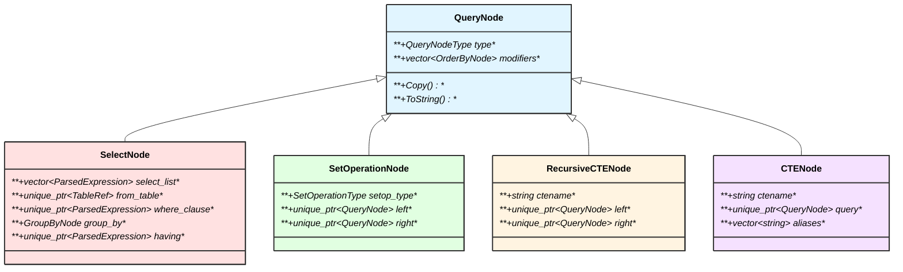

## TableRef 系统

TableRef 表示查询中的表引用，支持各种复杂的表操作。

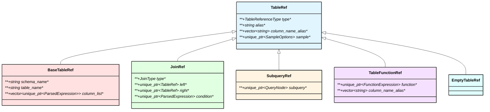

## Parser 扩展机制

DuckDB 支持通过扩展添加自定义语法支持。

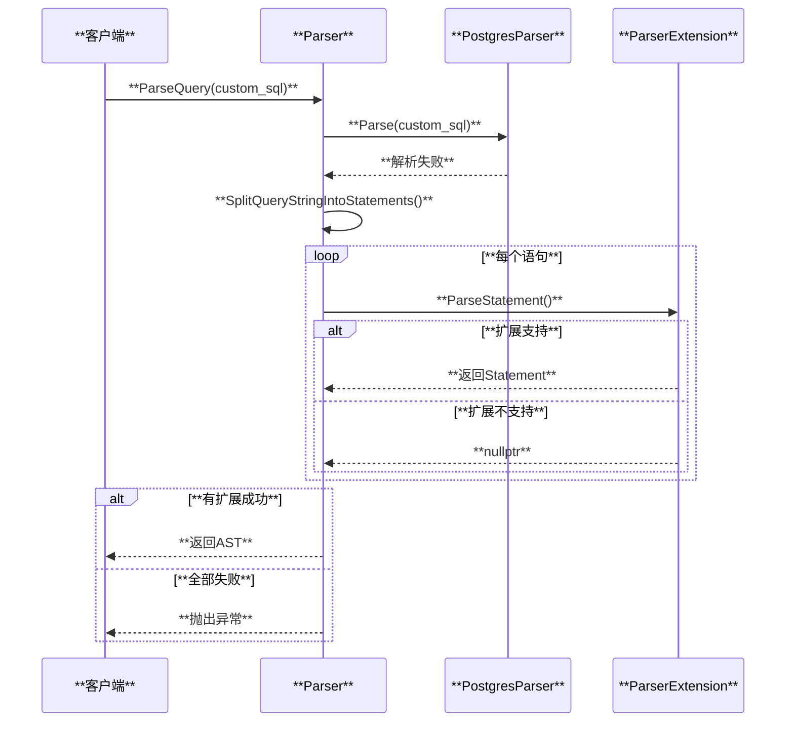

## 错误处理

Parser 提供详细的错误信息，包括错误位置和上下文。

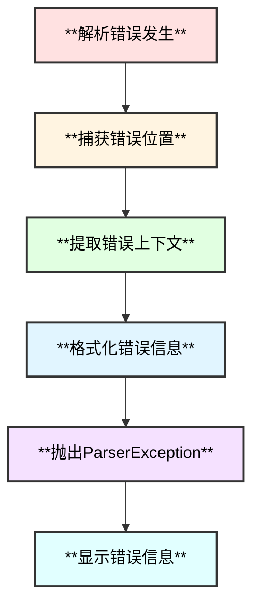

**错误信息示例：**
```
Parser Error: syntax error at or near "SELEC"
LINE 1: SELEC * FROM users;
        ^
```

## 特殊功能

### 1. Unicode 空格处理

Parser 自动检测并替换 Unicode 空格字符：

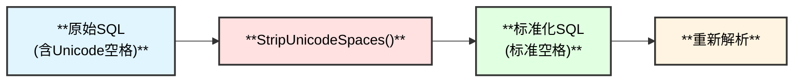

### 2. Dollar-Quoted 字符串

支持 PostgreSQL 风格的 Dollar-Quoted 字符串：

```sql
SELECT $$This is a string with 'quotes'$$;
SELECT $tag$Multi-line
string content$tag$;
```

### 3. 参数化查询

支持预处理语句的参数占位符：

```sql
PREPARE stmt AS SELECT * FROM users WHERE id = $1;
EXECUTE stmt(42);
```

## 性能优化

### 1. 栈深度检查

Transformer 检查表达式嵌套深度，防止栈溢出：

```cpp
if (root.stack_depth + extra_stack >= options.max_expression_depth) {
    throw ParserException("Max expression depth limit exceeded");
}
```

### 2. 延迟解析

只在必要时才进行完整的语法分析。

### 3. 缓存机制

重复查询可以复用已解析的 AST（在上层 Planner 实现）。

## 配置选项

Parser 支持多种配置选项：

| **选项** | **说明** | **默认值** |
|---------|---------|----------|
| **preserve_identifier_case** | 保留标识符大小写 | `false` |
| **max_expression_depth** | 最大表达式深度 | `1000` |
| **extensions** | 解析器扩展列表 | `nullptr` |

## 总结

DuckDB Parser 模块的核心特点：

1. **基于 PostgreSQL** - 利用成熟的 libpg_query 库
2. **完整 SQL 支持** - 支持标准 SQL 和扩展语法
3. **可扩展** - 支持自定义语法扩展
4. **错误友好** - 提供详细的错误信息
5. **表达式丰富** - 支持复杂的表达式类型
6. **QueryNode 灵活** - 支持复杂的查询组合
7. **性能优化** - 栈深度检查、延迟解析

Parser 是查询处理的第一步，为后续的 Binder、Planner 和 Optimizer 提供了结构化的 AST。

## 相关源码文件

### 核心文件
- `src/parser/parser.cpp` - Parser 主类
- `src/parser/transformer.cpp` - Transformer 基类
- `third_party/libpg_query/` - PostgreSQL 解析器库

### 语句类型
- `src/parser/statement/select_statement.cpp` - SELECT 语句
- `src/parser/statement/insert_statement.cpp` - INSERT 语句
- `src/parser/statement/update_statement.cpp` - UPDATE 语句
- `src/parser/statement/create_statement.cpp` - CREATE 语句

### 表达式类型
- `src/parser/expression/columnref_expression.cpp` - 列引用
- `src/parser/expression/function_expression.cpp` - 函数调用
- `src/parser/expression/constant_expression.cpp` - 常量
- `src/parser/expression/window_expression.cpp` - 窗口函数

### Transformer
- `src/parser/transform/statement/` - 语句转换
- `src/parser/transform/expression/` - 表达式转换
- `src/parser/transform/tableref/` - 表引用转换

