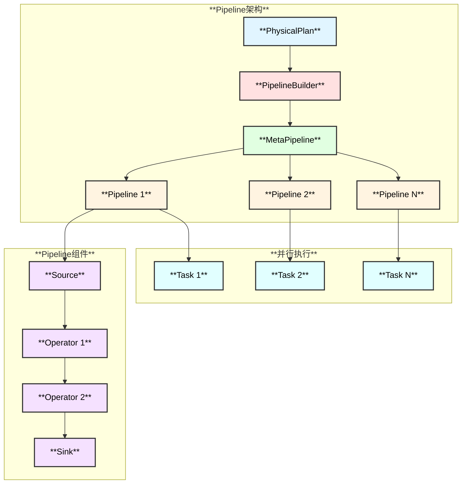
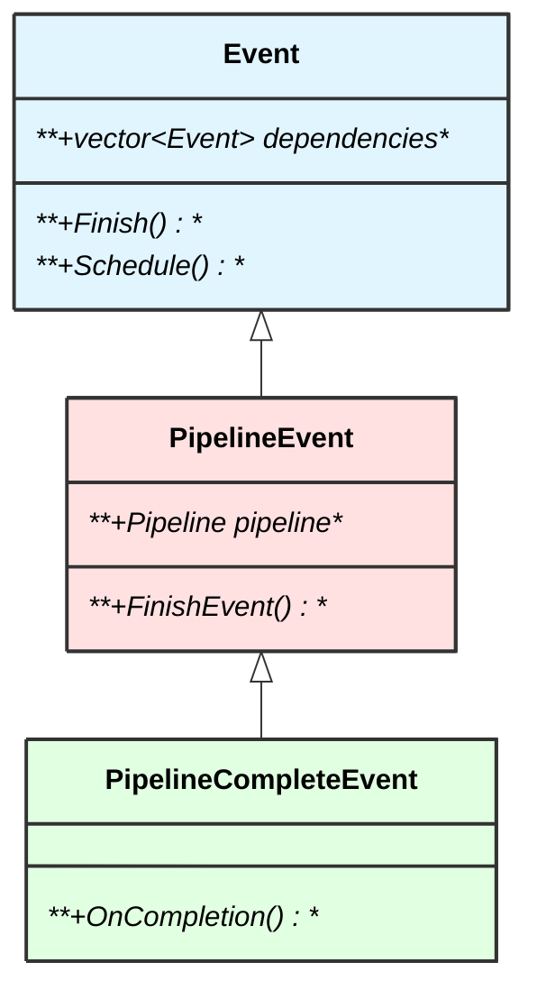
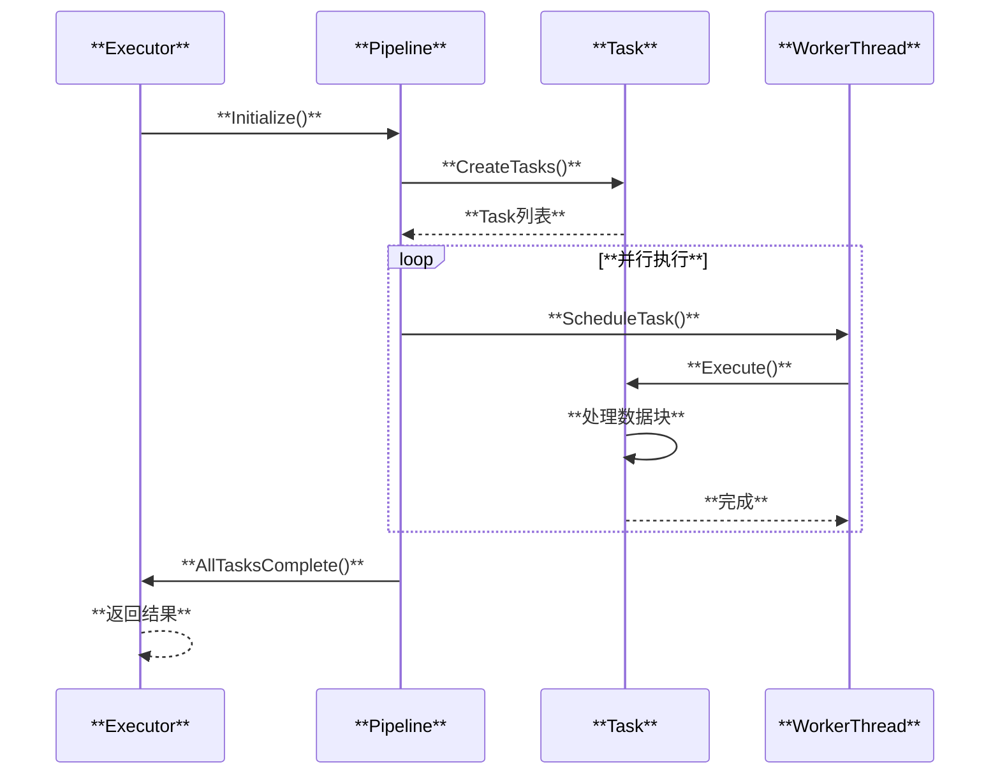

# DuckDB Pipeline 执行引擎

## 概述

DuckDB 使用 Pipeline 执行引擎实现并行查询处理。Pipeline 将查询分解为多个可并行执行的任务，利用多核 CPU 提升性能。

## 整体架构

## 核心概念

### Pipeline

Pipeline 是一组可以流式处理的算子序列。

### Event

Event 表示 Pipeline 执行中的异步事件，用于协调并行执行。

### Task

Task 是 Pipeline 执行的基本单元，可以在任意线程上执行。

## 执行流程

## 相关源码

- `src/parallel/pipeline.cpp` - Pipeline实现
- `src/parallel/event.cpp` - Event系统
- `src/parallel/executor_task.cpp` - Task实现
- `src/parallel/task_scheduler.cpp` - 任务调度器
- `src/parallel/meta_pipeline.cpp` - MetaPipeline

