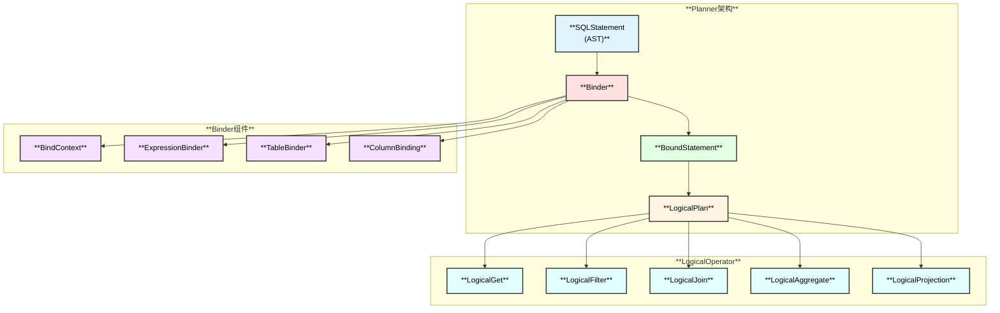
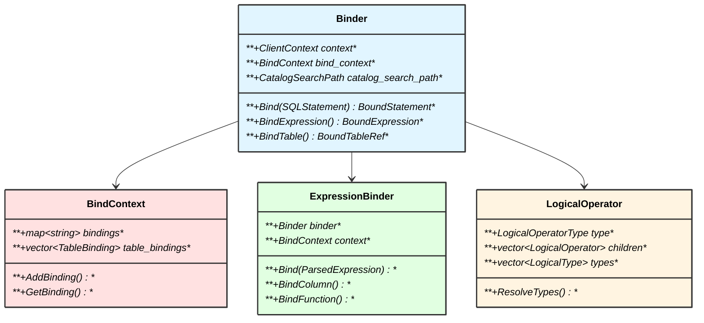
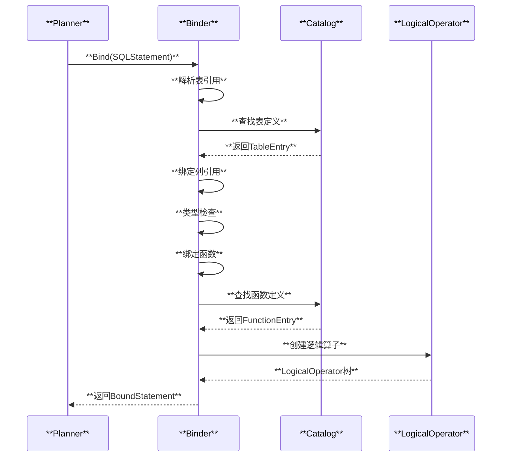
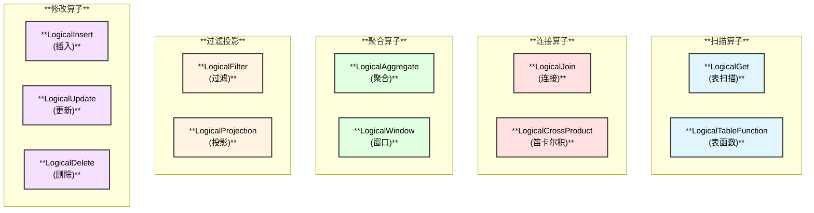

# DuckDB Planner 和 Binder 模块

## 概述

Planner 和 Binder 是 DuckDB 计算层的核心组件，负责将 Parser 生成的抽象语法树（AST）转换为逻辑执行计划。Binder 负责名称解析和类型检查，Planner 负责生成逻辑算子树。

## 整体架构

## Binder 核心功能

## 绑定流程

## LogicalOperator 类型

## 相关源码

- `src/planner/planner.cpp` - Planner主类
- `src/planner/binder.cpp` - Binder主类
- `src/planner/bind_context.cpp` - 绑定上下文
- `src/planner/expression_binder.cpp` - 表达式绑定器
- `src/planner/operator/` - 逻辑算子实现

