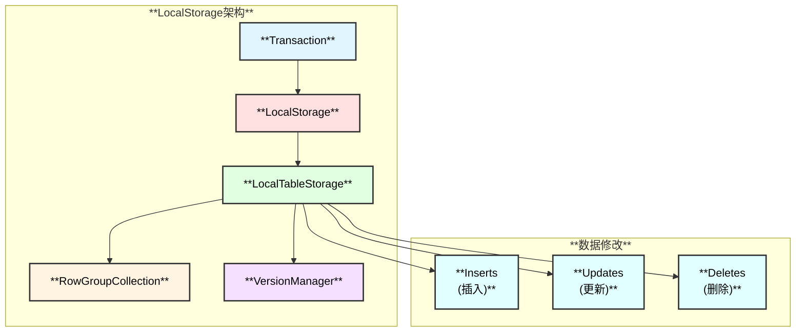
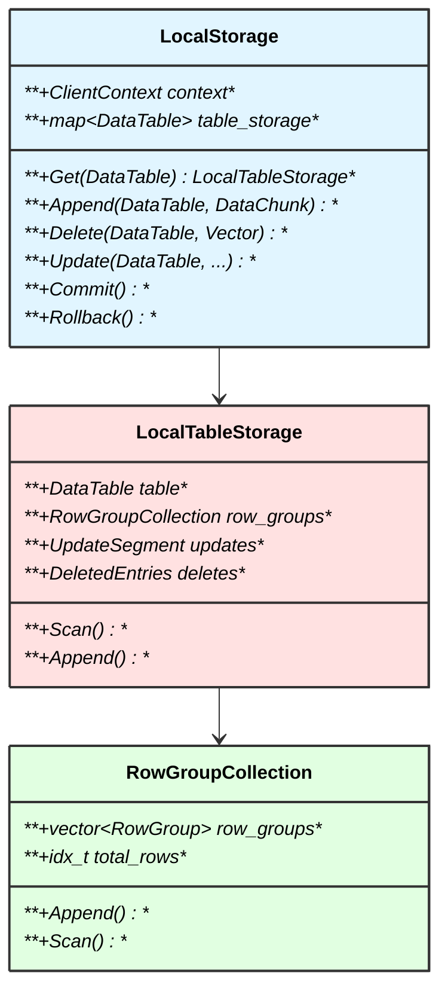
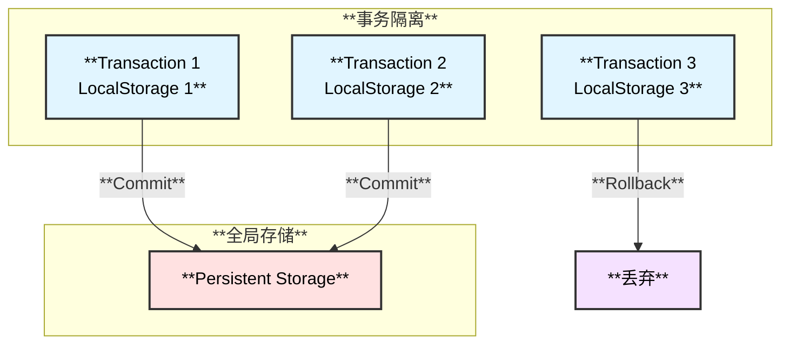
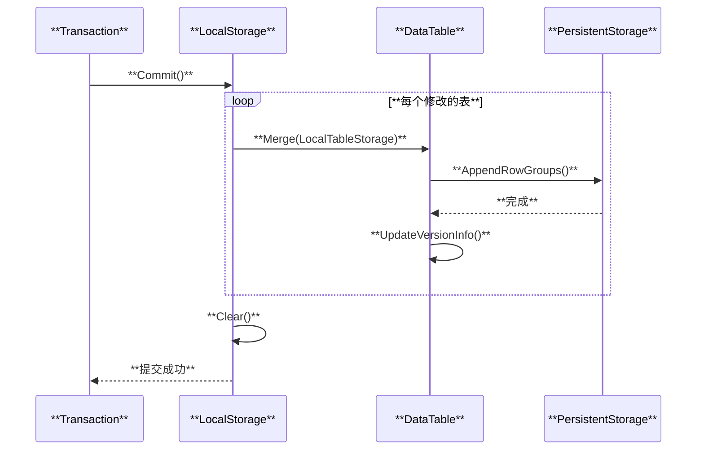

# DuckDB LocalStorage 模块

## 概述

LocalStorage 是 DuckDB 的事务级临时存储模块，用于存储事务中尚未提交的数据修改（插入、更新、删除）。每个事务都有自己的 LocalStorage，事务提交时才将数据合并到全局存储。

## 整体架构

## 核心组件

## MVCC 支持

LocalStorage 实现多版本并发控制（MVCC）：

## 提交流程

## 相关源码

- `src/storage/local_storage.cpp` - LocalStorage主类
- `src/storage/data_table.cpp` - 数据表与LocalStorage集成
- `src/storage/table/row_group.cpp` - 行组管理
- `src/transaction/` - 事务管理

