# Parquet 文件格式设计与DuckDB实现

## 概述

Apache Parquet 是一种面向列式存储的开源文件格式，专为大数据处理场景设计。Parquet 文件格式在 Hadoop 生态系统中被广泛使用，提供了高效的数据压缩和编码方案，能够显著提升查询性能。DuckDB 内置了对 Parquet 格式的完整支持，可以直接读取和写入 Parquet 文件。

本文档深入分析 Parquet 文件格式的设计架构、编码机制和 DuckDB 中的具体实现。

## Parquet 文件格式架构

### 整体架构

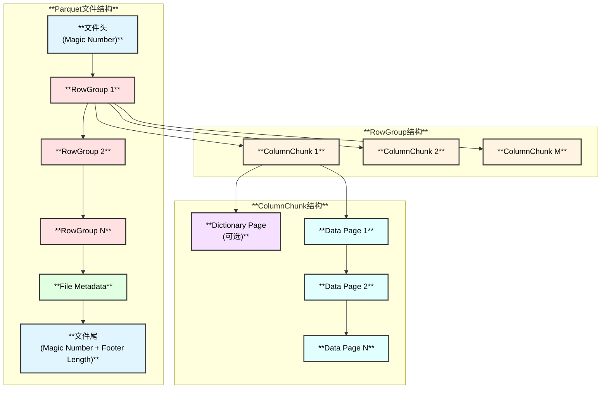

### 文件布局

Parquet 文件采用 **页脚式设计**（Footer Layout），元数据存储在文件末尾：

```mermaid
graph LR
    A["**Magic: PAR1<br/>(4字节)**"]
    B["**Row Group 1<br/>(数据)**"]
    C["**Row Group 2<br/>(数据)**"]
    D["**...**"]
    E["**File Metadata<br/>(元数据)**"]
    F["**Footer Length<br/>(4字节)**"]
    G["**Magic: PAR1<br/>(4字节)**"]
    
    A --> B
    B --> C
    C --> D
    D --> E
    E --> F
    F --> G
    
    style A fill:#e1f5ff,stroke:#333,stroke-width:2px,color:#000
    style B fill:#ffe1e1,stroke:#333,stroke-width:2px,color:#000
    style C fill:#ffe1e1,stroke:#333,stroke-width:2px,color:#000
    style D fill:#ffe1e1,stroke:#333,stroke-width:2px,color:#000
    style E fill:#e1ffe1,stroke:#333,stroke-width:2px,color:#000
    style F fill:#fff4e1,stroke:#333,stroke-width:2px,color:#000
    style G fill:#e1f5ff,stroke:#333,stroke-width:2px,color:#000
```

**关键特点：**
1. **文件头**：4字节魔术字"PAR1"（加密文件为"PARE"）
2. **数据区**：多个 RowGroup，每个包含所有列的数据
3. **元数据区**：FileMetadata，包含 Schema、RowGroup 信息、统计数据等
4. **文件尾**：4字节 Footer 长度 + 4字节魔术字"PAR1"

### 核心概念

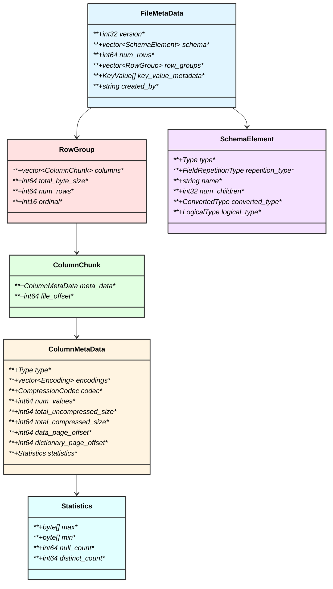

## 数据组织模型

### RowGroup（行组）

RowGroup 是 Parquet 文件的物理分区单元，包含表中所有列的一个子集行数据。

**特点：**
- **默认大小**：通常为 128MB 或 256MB
- **列存储**：每个 RowGroup 内部按列组织数据
- **独立性**：每个 RowGroup 可以独立读取和处理
- **统计信息**：包含每列的 min/max/null_count 等统计数据

### ColumnChunk（列块）

ColumnChunk 表示 RowGroup 中某一列的所有数据。

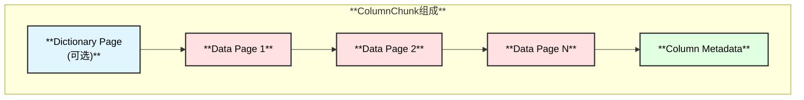

### Data Page（数据页）

Data Page 是 Parquet 中最小的数据单元，包含实际的列值。

**页结构：**

```
+------------------------------------------+
|              Page Header                 |
|  +------------------------------------+  |
|  | page_type: DATA_PAGE / DATA_PAGE_V2 | |
|  | uncompressed_page_size              |  |
|  | compressed_page_size                |  |
|  | crc (optional)                      |  |
|  +------------------------------------+  |
+------------------------------------------+
|         Repetition Levels (optional)     |
+------------------------------------------+
|         Definition Levels (optional)     |
+------------------------------------------+
|         Encoded Data (compressed)        |
+------------------------------------------+
```

**三级结构：**

1. **Repetition Levels** - 嵌套数据的重复级别
2. **Definition Levels** - 可选字段的定义级别
3. **Encoded Data** - 实际编码的数据值

## Schema 设计

### Schema 表示

Parquet 使用 **Dremel 论文** 中的嵌套结构表示法。

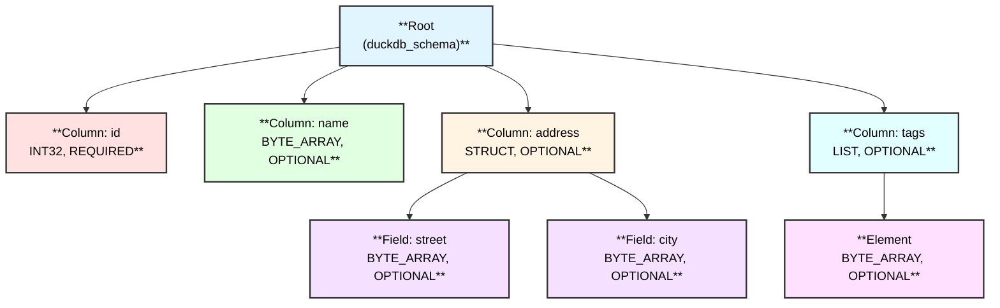

### Repetition Type（重复类型）

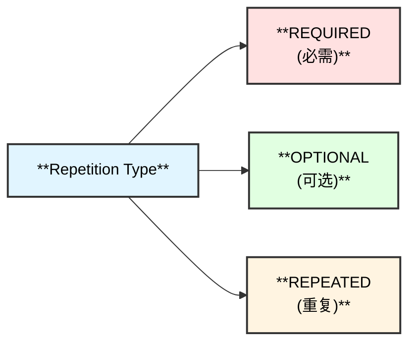

- **REQUIRED**: 值必须存在
- **OPTIONAL**: 值可以为 NULL
- **REPEATED**: 值可以重复（用于数组/列表）

## 编码机制

### 编码类型

Parquet 支持多种编码方式，针对不同数据类型和分布优化：

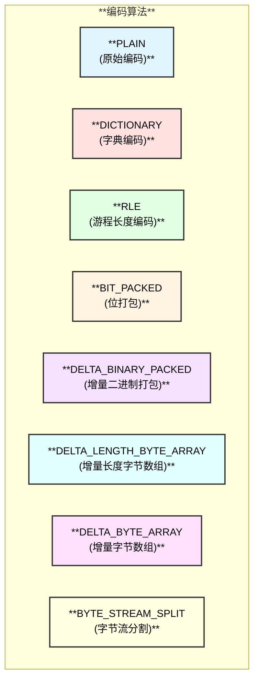

### 1. PLAIN（原始编码）

最简单的编码方式，直接存储原始值。

**适用场景：**
- 高基数数据
- 随机分布的数据
- 作为字典编码的回退方案

### 2. DICTIONARY（字典编码）

使用字典存储唯一值，数据存储字典索引。

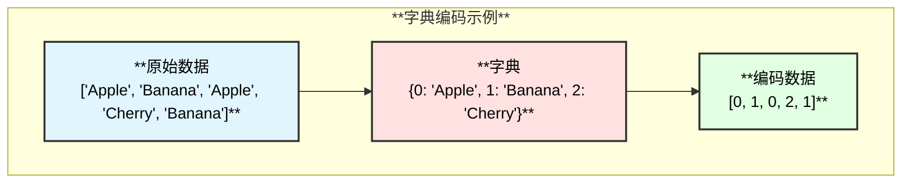

**优势：**
- 适合低基数列
- 显著减少存储空间
- 提高查询性能

### 3. RLE（游程长度编码）

压缩连续重复值的序列。

**示例：**
```
原始: [1, 1, 1, 1, 2, 2, 3, 3, 3]
编码: [(4, 1), (2, 2), (3, 3)]
```

### 4. DELTA_BINARY_PACKED（增量二进制打包）

存储值之间的差值（delta），并使用位打包压缩。

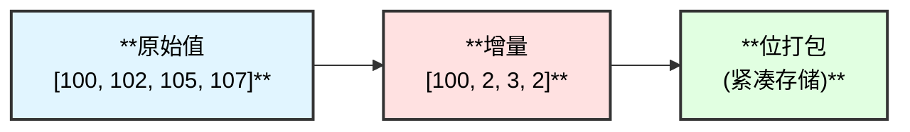

**适用场景：**
- 有序整数序列
- 时间戳列
- 自增 ID

### 5. DELTA_LENGTH_BYTE_ARRAY

对字符串长度使用增量编码，值使用原始编码。

**示例：**
```
原始: ["cat", "dog", "bird", "fish"]
长度: [3, 3, 4, 4]
长度增量: [3, 0, 1, 0]
```

### 6. BYTE_STREAM_SPLIT

将多字节值分割为多个字节流，提高压缩率。

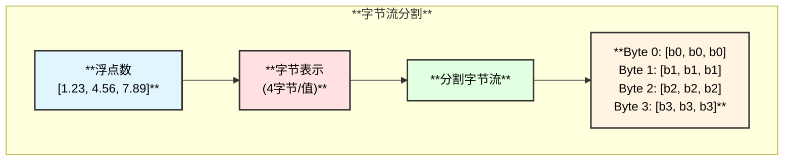

**优势：**
- 提高浮点数压缩率
- 适合科学计算数据

## 压缩算法

Parquet 支持多种压缩算法，可以在 ColumnChunk 级别指定：

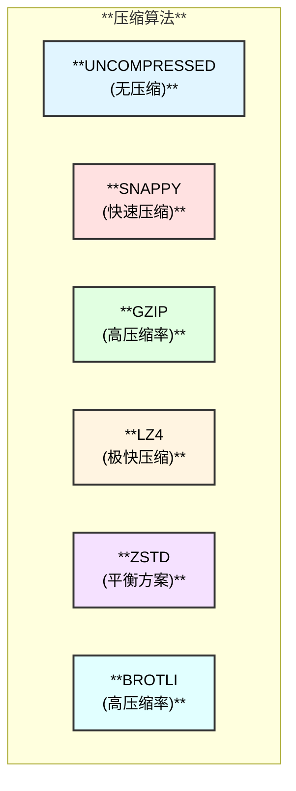

### 压缩算法对比

| 算法 | 压缩速度 | 解压速度 | 压缩率 | 适用场景 |
|------|---------|---------|-------|---------|
| **UNCOMPRESSED** | ✓✓✓✓✓ | ✓✓✓✓✓ | ✗ | 已压缩数据 |
| **SNAPPY** | ✓✓✓✓ | ✓✓✓✓✓ | ✓✓ | 实时查询 |
| **LZ4** | ✓✓✓✓✓ | ✓✓✓✓✓ | ✓✓ | 极致性能 |
| **ZSTD** | ✓✓✓ | ✓✓✓✓ | ✓✓✓✓ | 平衡方案 |
| **GZIP** | ✓✓ | ✓✓✓ | ✓✓✓✓ | 存储优先 |
| **BROTLI** | ✓ | ✓✓ | ✓✓✓✓✓ | 最小存储 |

## DuckDB 中的 Parquet 实现

### 架构概览

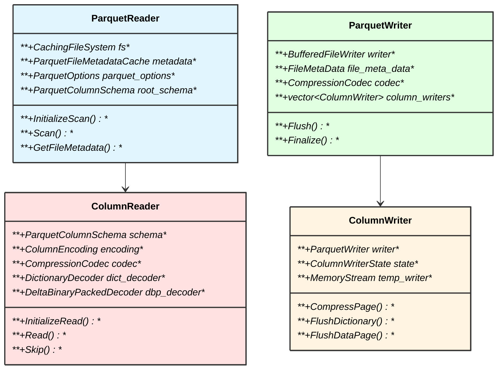

### 读取流程

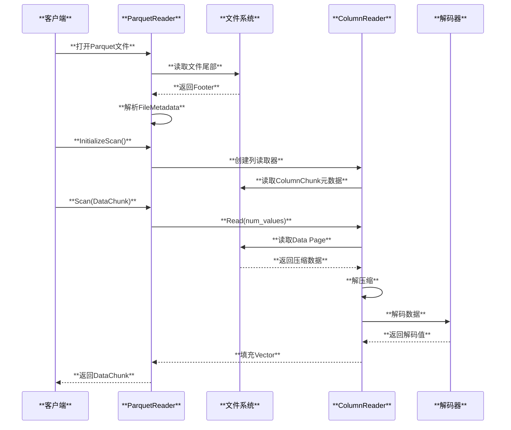

### 写入流程

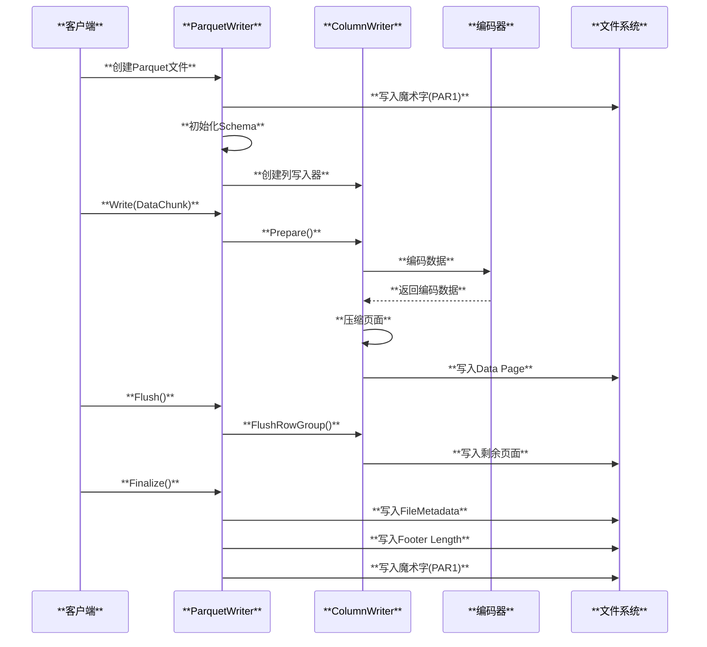

### 核心读取器实现

#### ColumnReader 解码流程

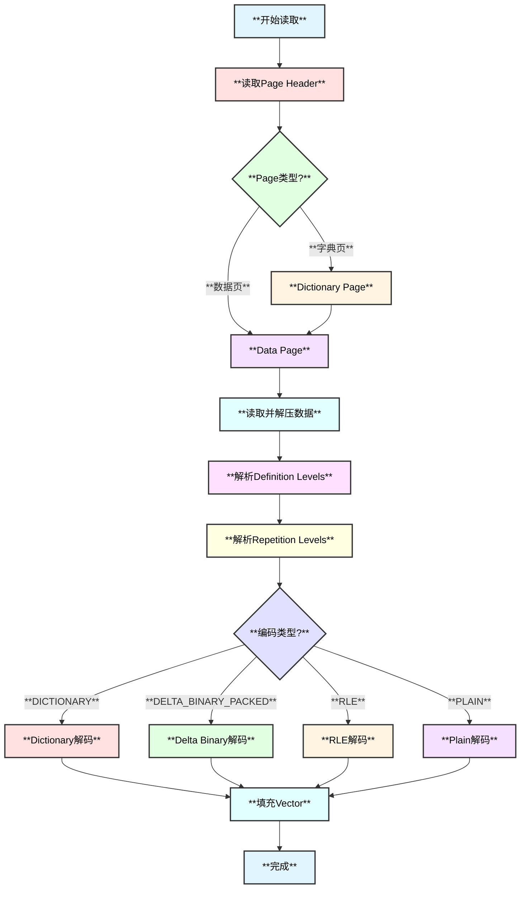

### 核心写入器实现

#### ColumnWriter 编码流程

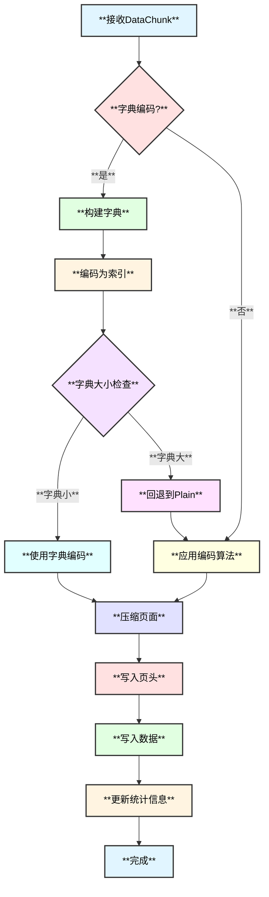

### 解码器实现

DuckDB 实现了多种解码器类来处理不同的编码格式：

```mermaid
classDiagram
    class DictionaryDecoder {
        **+vector~Value~ dictionary**
        **+RleBpDecoder index_decoder**
        **+Read()**
        **+LoadDictionary()**
    }
    
    class DeltaBinaryPackedDecoder {
        **+int64 last_value**
        **+vector~int64~ delta_buffer**
        **+Read()**
        **+ReadBlock()**
    }
    
    class DeltaByteArrayDecoder {
        **+DeltaBinaryPackedDecoder prefix_decoder**
        **+DeltaBinaryPackedDecoder suffix_decoder**
        **+Read()**
    }
    
    class DeltaLengthByteArrayDecoder {
        **+DeltaBinaryPackedDecoder length_decoder**
        **+Read()**
    }
    
    class RLEDecoder {
        **+RleBpDecoder decoder**
        **+Read()**
    }
    
    class ByteStreamSplitDecoder {
        **+idx_t element_size**
        **+vector~byte_stream~ streams**
        **+Read()**
    }
    
    style DictionaryDecoder fill:#e1f5ff,stroke:#333,stroke-width:2px,color:#000
    style DeltaBinaryPackedDecoder fill:#ffe1e1,stroke:#333,stroke-width:2px,color:#000
    style DeltaByteArrayDecoder fill:#e1ffe1,stroke:#333,stroke-width:2px,color:#000
    style DeltaLengthByteArrayDecoder fill:#fff4e1,stroke:#333,stroke-width:2px,color:#000
    style RLEDecoder fill:#f5e1ff,stroke:#333,stroke-width:2px,color:#000
    style ByteStreamSplitDecoder fill:#e1ffff,stroke:#333,stroke-width:2px,color:#000
```

## Parquet 优化技术

### 1. 谓词下推（Predicate Pushdown）

利用列统计信息跳过不满足条件的 RowGroup 和 Page：

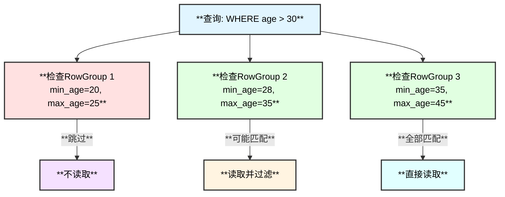

### 2. 列裁剪（Column Pruning）

只读取查询需要的列：

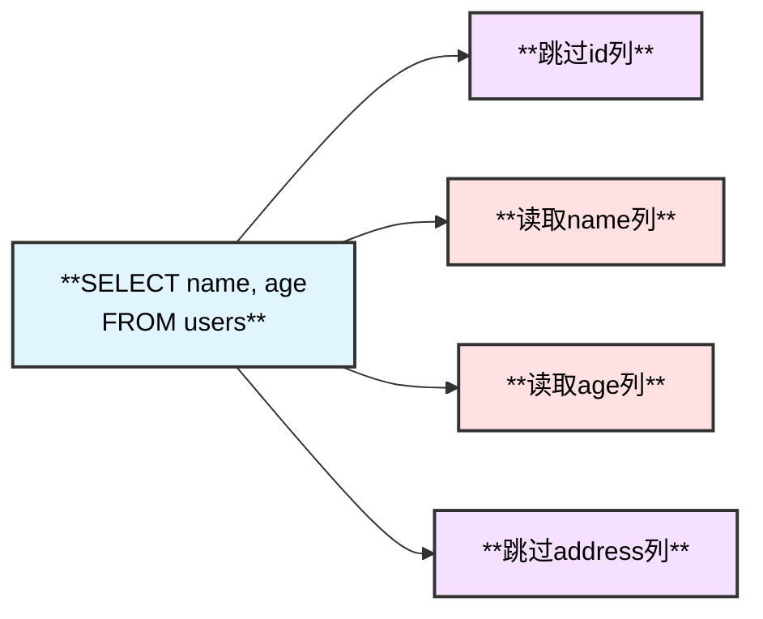

### 3. 元数据缓存

DuckDB 使用 `ParquetFileMetadataCache` 缓存文件元数据：

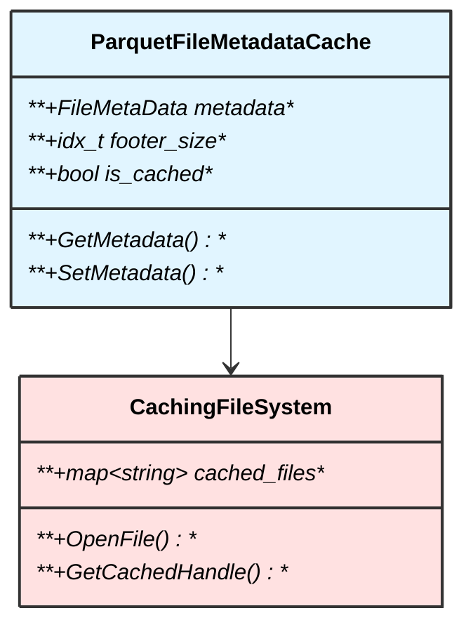

### 4. 并行读取

DuckDB 支持并行读取多个 RowGroup：

```mermaid
graph TB
    subgraph "**并行读取架构**"
        A["**主线程**"]
        B["**线程1: RowGroup 1**"]
        C["**线程2: RowGroup 2**"]
        D["**线程3: RowGroup 3**"]
        E["**线程4: RowGroup 4**"]
        F["**合并结果**"]
    end
    
    A --> B
    A --> C
    A --> D
    A --> E
    B --> F
    C --> F
    D --> F
    E --> F
    
    style A fill:#e1f5ff,stroke:#333,stroke-width:2px,color:#000
    style B fill:#ffe1e1,stroke:#333,stroke-width:2px,color:#000
    style C fill:#ffe1e1,stroke:#333,stroke-width:2px,color:#000
    style D fill:#ffe1e1,stroke:#333,stroke-width:2px,color:#000
    style E fill:#ffe1e1,stroke:#333,stroke-width:2px,color:#000
    style F fill:#e1ffe1,stroke:#333,stroke-width:2px,color:#000
```

## Parquet 扩展功能

### 1. GeoParquet

DuckDB 支持 GeoParquet 规范，用于存储地理空间数据：

```json
{
  "version": "1.0.0",
  "primary_column": "geometry",
  "columns": {
    "geometry": {
      "encoding": "WKB",
      "geometry_types": ["Point", "LineString"],
      "bbox": [-180.0, -90.0, 180.0, 90.0],
      "projjson": {...}
    }
  }
}
```

### 2. 加密支持

DuckDB 支持加密的 Parquet 文件（魔术字为"PARE"）：

```mermaid
graph LR
    A["**PARE<br/>(加密文件)**"]
    B["**AES-GCM加密<br/>RowGroup**"]
    C["**加密元数据**"]
    D["**Footer**"]
    E["**PARE<br/>(文件尾)**"]
    
    A --> B
    B --> C
    C --> D
    D --> E
    
    style A fill:#e1f5ff,stroke:#333,stroke-width:2px,color:#000
    style B fill:#ffe1e1,stroke:#333,stroke-width:2px,color:#000
    style C fill:#e1ffe1,stroke:#333,stroke-width:2px,color:#000
    style D fill:#fff4e1,stroke:#333,stroke-width:2px,color:#000
    style E fill:#e1f5ff,stroke:#333,stroke-width:2px,color:#000
```

### 3. Bloom Filter

Parquet 支持 Bloom Filter 用于快速成员测试：

```mermaid
graph TB
    A["**列数据**"]
    B["**构建Bloom Filter**"]
    C["**存储在元数据**"]
    D{**查询过滤**}
    E["**Bloom Filter测试**"]
    F["**肯定不存在**"]
    G["**可能存在**"]
    H["**跳过RowGroup**"]
    I["**读取并验证**"]
    
    A --> B
    B --> C
    D --> E
    E --> F
    E --> G
    F --> H
    G --> I
    
    style A fill:#e1f5ff,stroke:#333,stroke-width:2px,color:#000
    style B fill:#ffe1e1,stroke:#333,stroke-width:2px,color:#000
    style C fill:#e1ffe1,stroke:#333,stroke-width:2px,color:#000
    style D fill:#fff4e1,stroke:#333,stroke-width:2px,color:#000
    style E fill:#f5e1ff,stroke:#333,stroke-width:2px,color:#000
    style F fill:#ffe1ff,stroke:#333,stroke-width:2px,color:#000
    style G fill:#e1ffe1,stroke:#333,stroke-width:2px,color:#000
    style H fill:#f5e1ff,stroke:#333,stroke-width:2px,color:#000
    style I fill:#e1ffff,stroke:#333,stroke-width:2px,color:#000
```

## 使用示例

### DuckDB 读取 Parquet

```sql
-- 直接查询Parquet文件
SELECT * FROM 'data.parquet' WHERE age > 30;

-- 查看Parquet元数据
SELECT * FROM parquet_metadata('data.parquet');

-- 查看Schema信息
SELECT * FROM parquet_schema('data.parquet');

-- 查看文件元数据
SELECT * FROM parquet_file_metadata('data.parquet');
```

### DuckDB 写入 Parquet

```sql
-- 基本写入
COPY (SELECT * FROM users) TO 'output.parquet';

-- 指定压缩算法
COPY users TO 'output.parquet' (COMPRESSION 'ZSTD');

-- 指定行组大小
COPY users TO 'output.parquet' (ROW_GROUP_SIZE 100000);

-- 多种选项组合
COPY users TO 'output.parquet' (
    COMPRESSION 'ZSTD',
    ROW_GROUP_SIZE 100000,
    ROW_GROUP_SIZE_BYTES '128MB'
);
```

## 性能优化建议

### 1. 选择合适的行组大小

- **推荐大小**：128MB - 256MB
- **过小**：增加元数据开销，减少并行度
- **过大**：降低读取效率，增加内存压力

### 2. 选择合适的压缩算法

```mermaid
graph TB
    A{**使用场景**}
    B["**实时查询<br/>→ SNAPPY/LZ4**"]
    C["**存储优先<br/>→ ZSTD/GZIP**"]
    D["**平衡方案<br/>→ ZSTD**"]
    E["**科学计算<br/>→ ZSTD + BSS编码**"]
    
    A --> B
    A --> C
    A --> D
    A --> E
    
    style A fill:#e1f5ff,stroke:#333,stroke-width:2px,color:#000
    style B fill:#ffe1e1,stroke:#333,stroke-width:2px,color:#000
    style C fill:#e1ffe1,stroke:#333,stroke-width:2px,color:#000
    style D fill:#fff4e1,stroke:#333,stroke-width:2px,color:#000
    style E fill:#f5e1ff,stroke:#333,stroke-width:2px,color:#000
```

### 3. 优化列顺序

将查询频繁的列放在前面，利用列裁剪减少I/O：

```
推荐顺序:
1. 频繁查询的过滤列
2. 频繁查询的选择列
3. 其他列
```

### 4. 利用分区

```mermaid
graph TB
    subgraph "**分区策略**"
        A["**年份分区<br/>year=2023/**"]
        B["**月份分区<br/>month=01/**"]
        C["**Parquet文件**"]
    end
    
    A --> B
    B --> C
    
    style A fill:#e1f5ff,stroke:#333,stroke-width:2px,color:#000
    style B fill:#ffe1e1,stroke:#333,stroke-width:2px,color:#000
    style C fill:#e1ffe1,stroke:#333,stroke-width:2px,color:#000
```

## 总结

Parquet 文件格式的核心优势：

1. **列式存储** - 高效的分析查询性能
2. **高压缩率** - 多种编码和压缩算法
3. **Schema 演化** - 支持添加/删除列
4. **谓词下推** - 利用统计信息跳过数据
5. **嵌套数据** - 原生支持复杂数据类型
6. **跨平台** - 广泛的生态系统支持

DuckDB 的 Parquet 实现特点：

1. **零拷贝读取** - 高效的内存管理
2. **并行处理** - 多线程读取 RowGroup
3. **智能缓存** - 元数据和数据缓存
4. **完整编码支持** - 支持所有主流编码
5. **扩展功能** - GeoParquet、加密、Bloom Filter

## 相关源码文件

### 核心读取
- `extension/parquet/parquet_reader.cpp` - Parquet 读取器
- `extension/parquet/column_reader.cpp` - 列读取器
- `extension/parquet/parquet_metadata.cpp` - 元数据解析

### 解码器
- `extension/parquet/decoder/dictionary_decoder.cpp` - 字典解码
- `extension/parquet/decoder/delta_binary_packed_decoder.cpp` - Delta 解码
- `extension/parquet/decoder/delta_byte_array_decoder.cpp` - Delta 字节数组解码
- `extension/parquet/decoder/delta_length_byte_array_decoder.cpp` - Delta 长度解码
- `extension/parquet/decoder/rle_decoder.cpp` - RLE 解码
- `extension/parquet/decoder/byte_stream_split_decoder.cpp` - 字节流分割解码

### 核心写入
- `extension/parquet/parquet_writer.cpp` - Parquet 写入器
- `extension/parquet/column_writer.cpp` - 列写入器
- `extension/parquet/writer/primitive_column_writer.cpp` - 原始类型写入

### 扩展功能
- `extension/parquet/geo_parquet.cpp` - GeoParquet 支持
- `extension/parquet/parquet_crypto.cpp` - 加密支持
- `extension/parquet/parquet_statistics.cpp` - 统计信息处理

