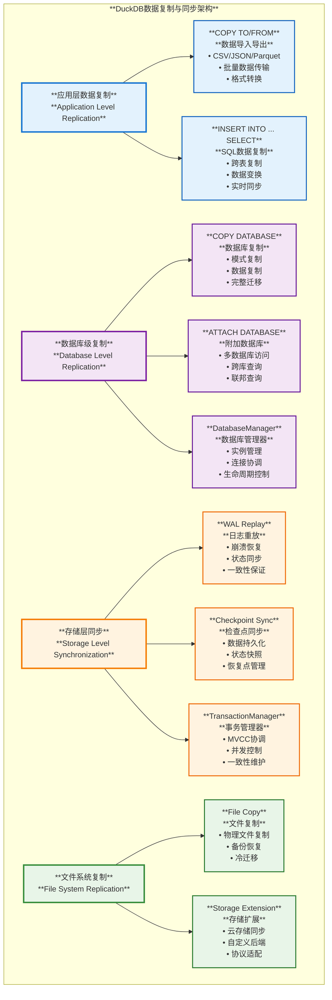
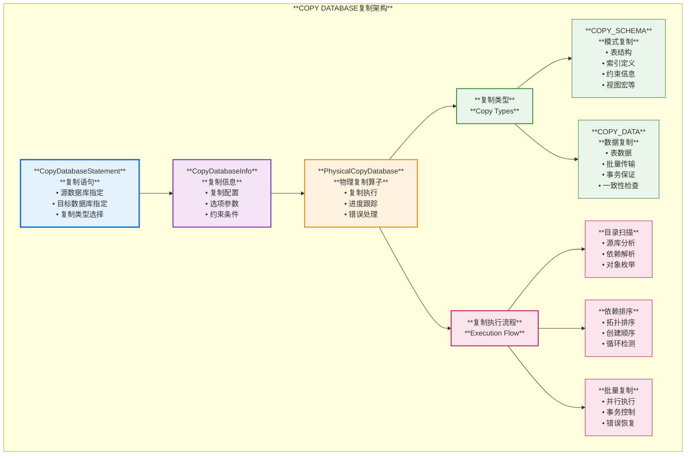
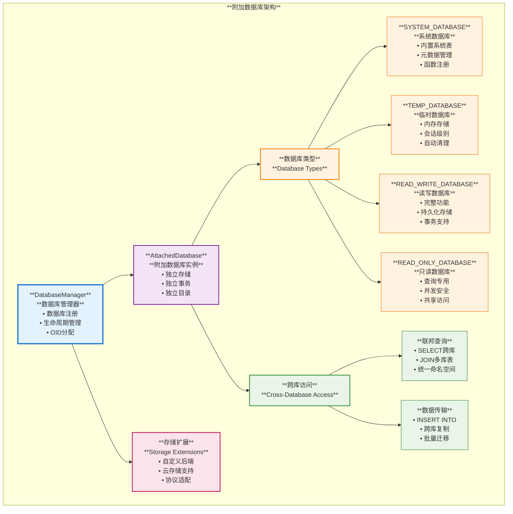
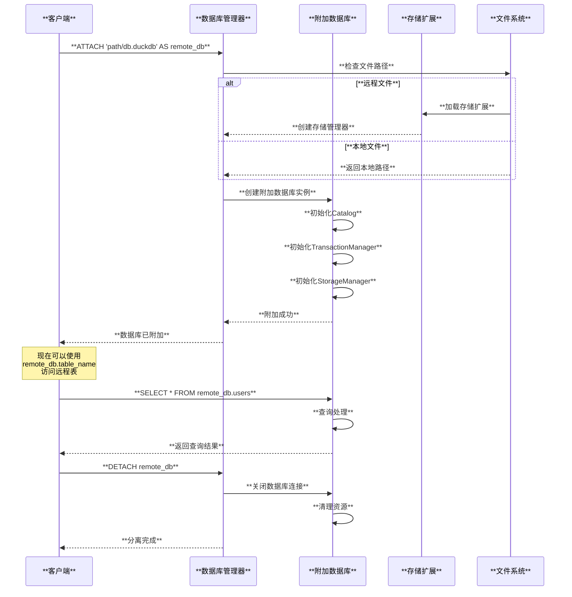
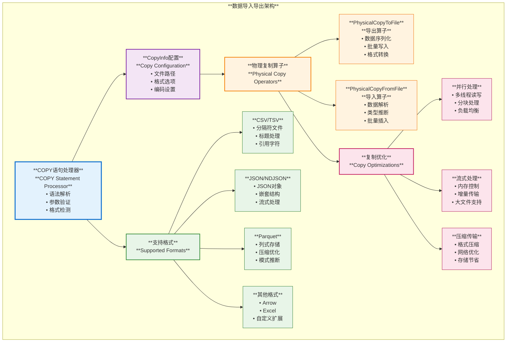
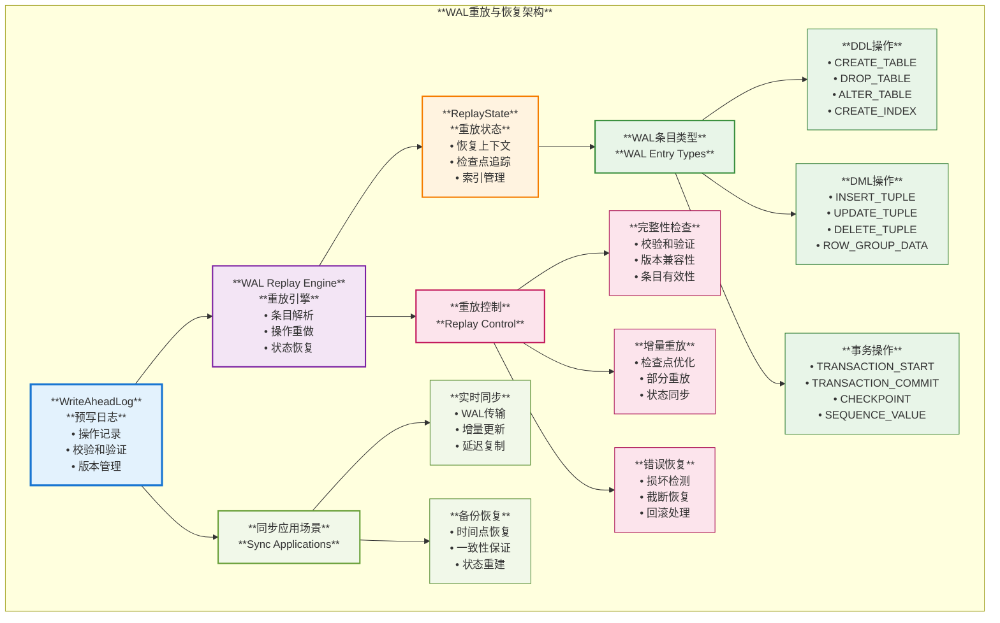
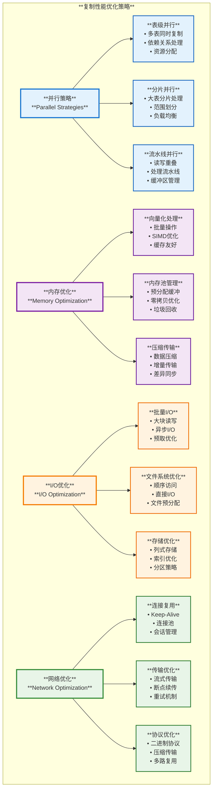
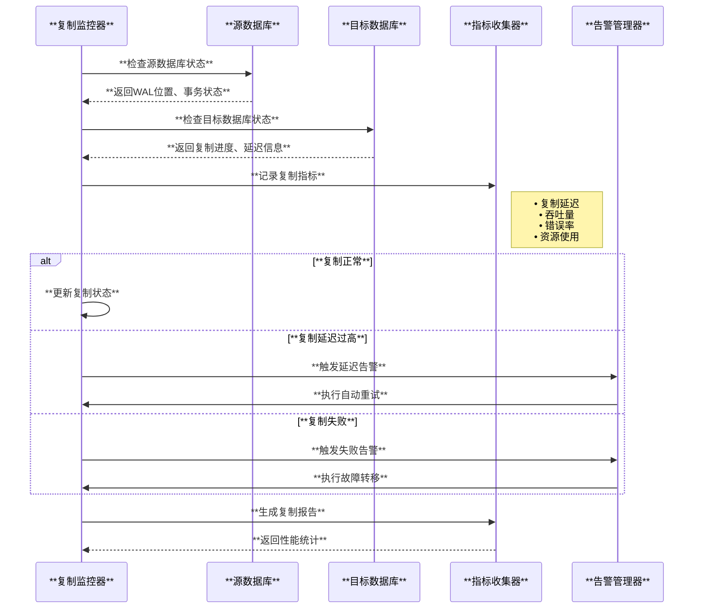

# **DuckDB 数据复制与同步机制深度分析**

## **概述**

DuckDB 作为嵌入式分析型数据库，虽然没有传统意义上的主从复制机制，但提供了多种数据复制、同步和迁移功能。本文档深入分析DuckDB的数据复制机制，包括数据库复制、附加数据库、数据导入导出、WAL重放等核心功能，为不同场景的数据同步需求提供解决方案。

---

## **1. DuckDB复制机制整体架构**

DuckDB的数据复制机制采用多层次设计，支持不同粒度和场景的数据复制需求。



---

## **2. 数据库级复制机制**

DuckDB的数据库级复制主要通过COPY DATABASE和附加数据库机制实现。

### **2.1 COPY DATABASE数据库复制**



#### **COPY DATABASE实现原理**

**源码位置**: `src/planner/binder/statement/bind_copy_database.cpp`

**核心功能**:

```cpp
BoundStatement Binder::Bind(CopyDatabaseStatement &stmt) {
    auto &source_catalog = Catalog::GetCatalog(context, stmt.from_database);
    auto &target_catalog = Catalog::GetCatalog(context, stmt.to_database);
    
    if (&source_catalog == &target_catalog) {
        throw BinderException("Cannot copy from \"%s\" to \"%s\" - FROM and TO databases are the same",
                              stmt.from_database, stmt.to_database);
    }
    
    if (stmt.copy_type == CopyDatabaseType::COPY_SCHEMA) {
        // 复制数据库模式
        plan = BindCopyDatabaseSchema(source_catalog, target_catalog.GetName());
    } else {
        // 复制数据库数据
        plan = BindCopyDatabaseData(source_catalog, target_catalog.GetName());
    }
    
    return result;
}
```

**复制类型**:

- **COPY_SCHEMA**: 只复制数据库结构（表、索引、视图、约束等）
- **COPY_DATA**: 复制数据内容，包括所有表中的数据行

**使用场景**:

- **数据库迁移**: 从一个DuckDB实例迁移到另一个实例
- **备份恢复**: 创建数据库的完整副本
- **开发测试**: 从生产环境复制数据到测试环境
- **数据分发**: 将中央数据库分发到边缘节点

### **2.2 ATTACH DATABASE附加数据库机制**



#### **附加数据库实现**

**源码位置**: `src/main/attached_database.cpp`, `src/main/database_manager.cpp`

**数据库附加流程**:

```cpp
optional_ptr<AttachedDatabase> DatabaseManager::AttachDatabase(ClientContext &context, 
                                                               AttachInfo &info, 
                                                               AttachOptions &options) {
    // 检查远程文件和扩展
    if (FileSystem::IsRemoteFile(info.path, extension)) {
        if (!ExtensionHelper::TryAutoLoadExtension(context, extension)) {
            throw MissingExtensionException("Attaching path '%s' requires extension '%s'", 
                                          info.path, extension);
        }
    }
    
    // 创建附加数据库实例
    auto &db = DatabaseInstance::GetDatabase(context);
    auto attached_db = db.CreateAttachedDatabase(context, info, options);
    
    // 注册到数据库管理器
    if (!databases->CreateEntry(context, name, std::move(attached_db), dependencies)) {
        throw BinderException("Failed to attach database: database with name \"%s\" already exists", name);
    }
    
    return GetDatabase(context, name);
}
```

**附加数据库特性**:

- **独立存储**: 每个附加数据库有独立的存储管理器
- **独立事务**: 每个数据库维护自己的事务状态
- **统一访问**: 通过database.table语法访问跨库对象
- **扩展支持**: 支持自定义存储扩展和协议

---

## **3. 数据复制执行流程**

### **3.1 完整数据库复制流程**

```mermaid
sequenceDiagram
    participant Client as **客户端**
    participant Binder as **Binder**<br/>**绑定器**
    participant SourceCatalog as **源数据库目录**
    participant TargetCatalog as **目标数据库目录**
    participant CopyOperator as **复制算子**
    participant DependencyMgr as **依赖管理器**
    participant TransactionMgr as **事务管理器**
    
    Client->>Binder: **COPY FROM db1 TO db2**
    Binder->>SourceCatalog: **扫描源数据库结构**
    SourceCatalog-->>Binder: **返回对象列表**
    
    Binder->>TargetCatalog: **验证目标数据库**
    TargetCatalog-->>Binder: **确认访问权限**
    
    Binder->>DependencyMgr: **分析对象依赖关系**
    Note right of DependencyMgr: 拓扑排序<br/>循环检测<br/>创建顺序
    DependencyMgr-->>Binder: **返回排序后对象**
    
    Binder->>CopyOperator: **创建复制计划**
    CopyOperator->>TransactionMgr: **开始事务**
    
    loop **复制每个对象**
        CopyOperator->>SourceCatalog: **读取对象定义**
        SourceCatalog-->>CopyOperator: **返回DDL/数据**
        
        alt **模式复制**
            CopyOperator->>TargetCatalog: **创建表/索引/视图**
        else **数据复制**
            CopyOperator->>TargetCatalog: **批量插入数据**
            Note right: 向量化插入<br/>批量优化<br/>进度跟踪
        end
        
        TargetCatalog-->>CopyOperator: **确认创建/插入成功**
    end
    
    CopyOperator->>TransactionMgr: **提交事务**
    TransactionMgr-->>CopyOperator: **提交成功**
    
    CopyOperator-->>Client: **复制完成统计**
    Note over Client: 返回复制对象数量<br/>或处理行数
```

### **3.2 附加数据库访问流程**



---

## **4. 数据导入导出复制机制**

DuckDB提供强大的数据导入导出功能，支持多种格式的数据复制。

### **4.1 COPY TO/FROM架构**



#### **COPY TO/FROM实现特性**

**并行文件写入**: `src/execution/operator/persistent/physical_copy_to_file.cpp`

```cpp
void PhysicalCopyToFile::WriteRotateInternal(ExecutionContext &context, 
                                             GlobalSinkState &global_state,
                                             const std::function<void(GlobalFunctionData &)> &fun) const {
    auto &g = global_state.Cast<CopyToFunctionGlobalState>();
    
    // 同步写入控制（支持并行写入到同一文件）
    while (true) {
        auto global_guard = g.lock.GetExclusiveLock();
        
        if (rotate && function.rotate_next_file(file_state, *bind_data, file_size_bytes)) {
            // 文件轮换逻辑
            auto owned_gstate = std::move(g.global_state);
            g.global_state = CreateFileState(context.client, *sink_state, *global_guard);
            
            // 等待当前文件写入完成
            auto file_guard = owned_lock->GetExclusiveLock();
            function.copy_to_finalize(context.client, *bind_data, *owned_gstate);
        } else {
            // 获取共享文件写锁
            auto file_guard = file_lock.GetSharedLock();
            global_guard.reset();
            
            // 执行数据写入
            fun(file_state);
            break;
        }
    }
}
```

**支持的复制模式**:

- **COPY_ERROR_ON_CONFLICT**: 冲突时报错
- **COPY_OVERWRITE**: 覆盖现有文件
- **COPY_OVERWRITE_OR_IGNORE**: 覆盖或忽略冲突
- **COPY_APPEND**: 追加到现有文件

---

## **5. WAL重放与恢复机制**

WAL重放机制是DuckDB数据一致性和崩溃恢复的核心，也是一种重要的数据同步方式。

### **5.1 WAL重放架构**



### **5.2 WAL重放实现机制**

**源码位置**: `src/storage/wal_replay.cpp`

#### **WAL重放核心流程**

```cpp
unique_ptr<WriteAheadLog> WriteAheadLog::Replay(FileSystem &fs, AttachedDatabase &db, 
                                                 const string &wal_path) {
    auto handle = fs.OpenFile(wal_path, FileFlags::FILE_FLAGS_READ);
    if (!handle) {
        // WAL不存在 - 创建空的WAL
        return make_uniq<WriteAheadLog>(db, wal_path);
    }
    
    // 重放WAL文件
    auto wal_handle = ReplayInternal(db, std::move(handle));
    if (wal_handle) {
        return wal_handle;
    }
    
    // 重放完成，可以删除WAL文件
    if (!db.IsReadOnly()) {
        fs.RemoveFile(wal_path);
    }
    return make_uniq<WriteAheadLog>(db, wal_path);
}
```

#### **增量重放优化**

```cpp
// 检查点优化重放
if (checkpoint_state.checkpoint_id.IsValid()) {
    auto &manager = database.GetStorageManager();
    if (manager.IsCheckpointClean(checkpoint_state.checkpoint_id)) {
        // WAL内容已经检查点化，可以安全截断
        return nullptr;
    }
}

// 执行实际重放
while (true) {
    auto deserializer = WriteAheadLogDeserializer::Open(state, reader);
    if (deserializer.ReplayEntry()) {
        con.Commit();
        
        // 提交待处理的索引
        for (auto &info : state.replay_index_infos) {
            info.index_list.get().AddIndex(std::move(info.index));
        }
        state.replay_index_infos.clear();
        
        if (reader.Finished()) {
            all_succeeded = true;
            break;
        }
    }
}
```

---

## **6. 复制性能优化策略**

### **6.1 并行复制优化**



### **6.2 复制监控与管理**



**关键复制指标**:

- **复制延迟**: 源端更新到目标端应用的时间差
- **复制吞吐量**: 单位时间内复制的数据量
- **复制一致性**: 数据一致性检查和校验
- **资源使用**: CPU、内存、网络、磁盘I/O使用率

---

## **7. 复制应用场景与最佳实践**

### **7.1 典型应用场景**

#### **数据迁移场景**

```sql
-- 完整数据库迁移
COPY FROM DATABASE source_db TO target_db (SCHEMA);
COPY FROM DATABASE source_db TO target_db (DATA);

-- 选择性表迁移
ATTACH 'source.duckdb' AS source_db;
CREATE TABLE target_table AS SELECT * FROM source_db.source_table;
DETACH source_db;
```

#### **数据同步场景**

```sql
-- 增量数据同步
ATTACH 'replica.duckdb' AS replica;
INSERT INTO replica.users 
SELECT * FROM main.users 
WHERE updated_at > (SELECT MAX(updated_at) FROM replica.users);
```

#### **备份恢复场景**

```sql
-- 创建备份
COPY DATABASE main TO backup_path;

-- 恢复备份
ATTACH 'backup.duckdb' AS backup;
COPY FROM DATABASE backup TO main (DATA);
```

### **7.2 最佳实践建议**

**性能优化**:

- 使用批量操作代替逐行处理
- 合理设置并行度，避免资源竞争
- 利用列式存储和压缩优化传输
- 定期检查点减少WAL重放时间

**可靠性保障**:

- 实施复制监控和告警机制
- 定期验证数据一致性
- 建立故障转移和恢复流程
- 保留足够的WAL历史用于恢复

**安全性考虑**:

- 加密敏感数据传输
- 实施访问控制和权限管理
- 审计复制操作和访问日志
- 定期安全评估和漏洞修复

---

## **8. 总结与展望**

### **8.1 DuckDB复制机制优势**

**设计优势**:

- **简单高效**: 嵌入式设计，无需复杂的集群管理
- **灵活多样**: 支持多种复制模式和应用场景
- **性能优异**: 向量化处理和并行优化
- **可靠稳定**: WAL保证和事务一致性

**技术特色**:

- **文件级复制**: 支持整个数据库文件的复制
- **格式丰富**: 支持多种数据格式的导入导出
- **扩展支持**: 插件化的存储后端支持
- **云原生**: 原生支持云存储和远程访问

### **8.2 适用场景总结**

**推荐场景**:

- **数据分析**: 分析型工作负载的数据分发
- **边缘计算**: 中心到边缘的数据同步
- **开发测试**: 生产数据到测试环境的复制
- **数据备份**: 定期备份和灾难恢复

**性能特点**:

- **高吞吐量**: 批量处理优化，适合大数据传输
- **低延迟**: 向量化执行，快速数据处理
- **资源高效**: 内存优化，适应各种硬件环境
- **扩展性好**: 支持从小型设备到大型服务器

### **8.3 发展方向**

**技术演进**:

- **实时复制**: 更低延迟的增量同步
- **智能优化**: AI驱动的复制策略优化
- **云原生**: 更好的云服务集成
- **多模复制**: 支持更多数据模型和格式

DuckDB的数据复制机制虽然与传统的主从复制不同，但其灵活性和高效性为现代数据分析场景提供了理想的数据同步解决方案。通过合理利用这些机制，可以构建高效、可靠、易维护的数据复制和同步系统。
