# DuckDB 底层文件存储设计

## 概述

DuckDB 是一个嵌入式分析型数据库，采用列式存储和先进的压缩技术。其底层存储系统设计巧妙，既保证了数据持久化的可靠性，又提供了高效的查询性能。本文档深入分析 DuckDB 的底层文件存储设计，包括文件格式、数据页设计、元数据管理和索引结构等核心组件。

## 整体架构

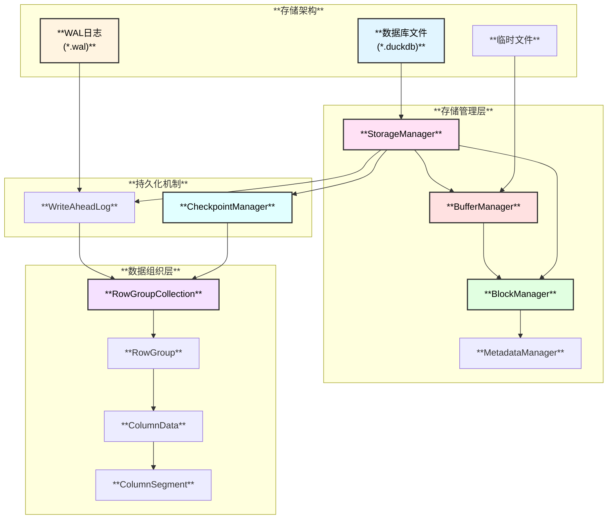
```mermaid
graph TB
    subgraph "**存储架构**"
        A["**数据库文件<br/>(*.duckdb)**"]
        B["**WAL日志<br/>(*.wal)**"]
        C["**临时文件**"]
    end
    
    subgraph "**存储管理层**"
        D["**StorageManager**"]
        E["**BlockManager**"]
        F["**BufferManager**"]
        G["**MetadataManager**"]
    end
    
    subgraph "**数据组织层**"
        H["**RowGroupCollection**"]
        I["**RowGroup**"]
        J["**ColumnData**"]
        K["**ColumnSegment**"]
    end
    
    subgraph "**持久化机制**"
        L["**CheckpointManager**"]
        M["**WriteAheadLog**"]
    end
    
    A --> D
    B --> M
    C --> F
    
    D --> E
    D --> F
    D --> L
    D --> M
    
    E --> G
    F --> E
    
    H --> I
    I --> J
    J --> K
    
    L --> H
    M --> H
    
    style A fill:#e1f5ff,stroke:#333,stroke-width:2px,color:#000
    style B fill:#fff4e1,stroke:#333,stroke-width:2px,color:#000
    style D fill:#ffe1f5,stroke:#333,stroke-width:2px,color:#000
    style E fill:#e1ffe1,stroke:#333,stroke-width:2px,color:#000
    style F fill:#ffe1e1,stroke:#333,stroke-width:2px,color:#000
    style H fill:#f5e1ff,stroke:#333,stroke-width:2px,color:#000
    style L fill:#e1ffff,stroke:#333,stroke-width:2px,color:#000
```

## 文件格式设计

### 文件结构

DuckDB 数据库文件采用单文件存储格式，主要包含以下部分：

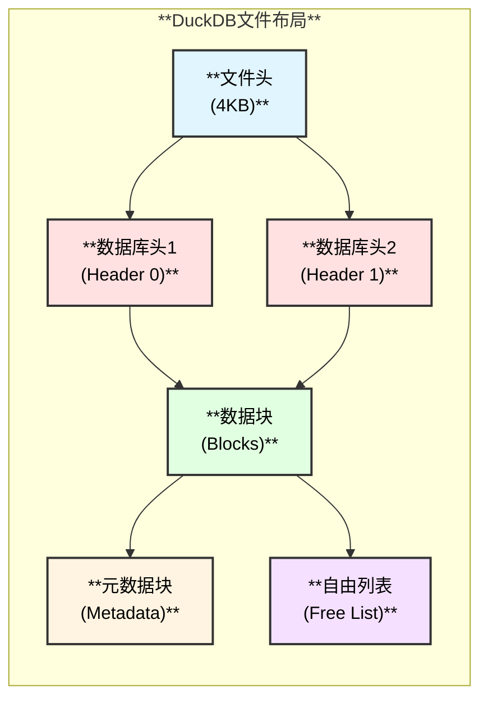
```mermaid
graph LR
    subgraph "**DuckDB文件布局**"
        A["**文件头<br/>(4KB)**"]
        B["**数据库头1<br/>(Header 0)**"]
        C["**数据库头2<br/>(Header 1)**"]
        D["**数据块<br/>(Blocks)**"]
        E["**元数据块<br/>(Metadata)**"]
        F["**自由列表<br/>(Free List)**"]
    end
    
    A --> B
    A --> C
    B --> D
    C --> D
    D --> E
    D --> F
    
    style A fill:#e1f5ff,stroke:#333,stroke-width:2px,color:#000
    style B fill:#ffe1e1,stroke:#333,stroke-width:2px,color:#000
    style C fill:#ffe1e1,stroke:#333,stroke-width:2px,color:#000
    style D fill:#e1ffe1,stroke:#333,stroke-width:2px,color:#000
    style E fill:#fff4e1,stroke:#333,stroke-width:2px,color:#000
    style F fill:#f5e1ff,stroke:#333,stroke-width:2px,color:#000
```

### MainHeader（主文件头）

**MainHeader** 是数据库文件的第一个头部，位于文件开始位置，大小为 4KB（FILE_HEADER_SIZE）。

**核心字段：**

```cpp
struct MainHeader {
    // 魔术字节 "DUCK" (4字节)
    static const char MAGIC_BYTES[];
    
    // 版本号
    uint64_t version_number;
    
    // 标志位数组 (4个标志)
    uint64_t flags[FLAG_COUNT];
    
    // 版本信息
    data_t library_git_desc[MAX_VERSION_SIZE];
    data_t library_git_hash[MAX_VERSION_SIZE];
    
    // 加密元数据（可选）
    data_t encryption_metadata[ENCRYPTION_METADATA_LEN];
    data_t salt[SALT_LEN];
    data_t encrypted_canary[CANARY_BYTE_SIZE];
};
```

**特点：**
- **魔术字节**：文件开始位置包含 "DUCK" 标识，用于识别 DuckDB 文件格式
- **版本控制**：记录数据库版本号和 Git 信息
- **加密支持**：支持数据库加密，包含盐值和加密元数据
- **一次写入**：通常在数据库创建时写入一次，之后不再修改

### DatabaseHeader（数据库头）

每个 DuckDB 文件包含两个 **DatabaseHeader**，采用**双缓冲机制**确保崩溃恢复的安全性。

**核心字段：**

```cpp
struct DatabaseHeader {
    // 迭代计数器（每次checkpoint递增）
    uint64_t iteration;
    
    // 元数据块指针
    idx_t meta_block;
    
    // 自由列表指针
    idx_t free_list;
    
    // 块计数
    uint64_t block_count;
    
    // 块分配大小（默认256KB）
    idx_t block_alloc_size;
    
    // 向量大小
    idx_t vector_size;
    
    // 序列化兼容性版本
    idx_t serialization_compatibility;
};
```

**双缓冲机制：**
- 系统启动时，选择 **iteration** 更大的头部作为活跃头部
- Checkpoint 时，更新另一个头部并递增 iteration
- 保证即使写入过程中崩溃，至少有一个有效的数据库头部

## 数据页（Block）设计

### Block 结构

DuckDB 的基本存储单元是 **Block**，默认大小为 **256KB**（262,144字节）。

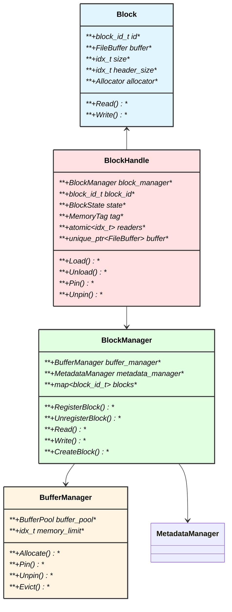
```mermaid
classDiagram
    class Block {
        **+block_id_t id**
        **+FileBuffer buffer**
        **+idx_t size**
        **+idx_t header_size**
        **+Allocator allocator**
        **+Read()**
        **+Write()**
    }
    
    class BlockHandle {
        **+BlockManager block_manager**
        **+block_id_t block_id**
        **+BlockState state**
        **+MemoryTag tag**
        **+atomic~idx_t~ readers**
        **+unique_ptr~FileBuffer~ buffer**
        **+Load()**
        **+Unload()**
        **+Pin()**
        **+Unpin()**
    }
    
    class BlockManager {
        **+BufferManager buffer_manager**
        **+MetadataManager metadata_manager**
        **+map~block_id_t~ blocks**
        **+RegisterBlock()**
        **+UnregisterBlock()**
        **+Read()**
        **+Write()**
        **+CreateBlock()**
    }
    
    class BufferManager {
        **+BufferPool buffer_pool**
        **+idx_t memory_limit**
        **+Allocate()**
        **+Pin()**
        **+Unpin()**
        **+Evict()**
    }
    
    Block <-- BlockHandle
    BlockHandle --> BlockManager
    BlockManager --> BufferManager
    BlockManager --> MetadataManager
    
    style Block fill:#e1f5ff,stroke:#333,stroke-width:2px,color:#000
    style BlockHandle fill:#ffe1e1,stroke:#333,stroke-width:2px,color:#000
    style BlockManager fill:#e1ffe1,stroke:#333,stroke-width:2px,color:#000
    style BufferManager fill:#fff4e1,stroke:#333,stroke-width:2px,color:#000
```

### Block 内部布局

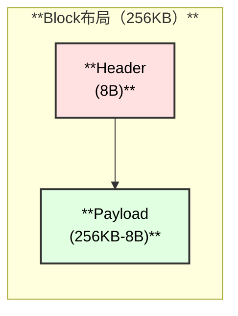
```mermaid
graph LR
    subgraph "**Block布局（256KB）**"
        A["**Header<br/>(8B)**"]
        B["**Payload<br/>(256KB-8B)**"]
    end
    
    A --> B
    
    style A fill:#ffe1e1,stroke:#333,stroke-width:2px,color:#000
    style B fill:#e1ffe1,stroke:#333,stroke-width:2px,color:#000
```

**Block Header（8字节）：**
- 包含块的元信息
- 用于块的验证和管理

**Payload：**
- 实际数据存储区域
- 存储行组、列段或元数据

### BlockManager 核心功能

**BlockManager** 负责块的生命周期管理：

1. **块注册**：`RegisterBlock()` - 注册新的块句柄
2. **块读取**：`Read()` - 从磁盘读取块数据
3. **块写入**：`Write()` - 将块数据写入磁盘
4. **块创建**：`CreateBlock()` - 创建新的块
5. **块注销**：`UnregisterBlock()` - 清理块资源

**块状态管理：**

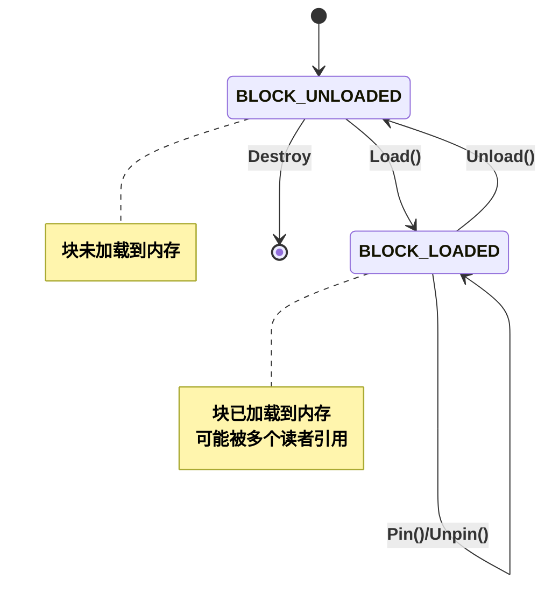
```mermaid
stateDiagram-v2
    [*] --> **BLOCK_UNLOADED**
    **BLOCK_UNLOADED** --> **BLOCK_LOADED** : **Load()**
    **BLOCK_LOADED** --> **BLOCK_UNLOADED** : **Unload()**
    **BLOCK_LOADED** --> **BLOCK_LOADED** : **Pin()/Unpin()**
    **BLOCK_UNLOADED** --> [*] : **Destroy**
    
    note right of **BLOCK_UNLOADED**
        **块未加载到内存**
    end note
    
    note right of **BLOCK_LOADED**
        **块已加载到内存**
        **可能被多个读者引用**
    end note
```

### BufferManager 和缓存策略

**BufferManager** 管理内存缓冲区，实现 LRU 驱逐策略：

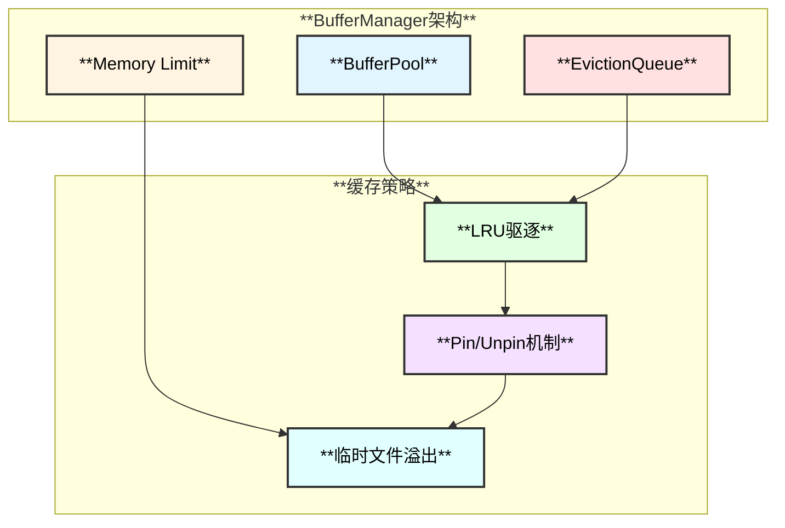
```mermaid
graph TB
    subgraph "**BufferManager架构**"
        A["**BufferPool**"]
        B["**EvictionQueue**"]
        C["**Memory Limit**"]
    end
    
    subgraph "**缓存策略**"
        D["**LRU驱逐**"]
        E["**Pin/Unpin机制**"]
        F["**临时文件溢出**"]
    end
    
    A --> D
    B --> D
    C --> F
    
    D --> E
    E --> F
    
    style A fill:#e1f5ff,stroke:#333,stroke-width:2px,color:#000
    style B fill:#ffe1e1,stroke:#333,stroke-width:2px,color:#000
    style C fill:#fff4e1,stroke:#333,stroke-width:2px,color:#000
    style D fill:#e1ffe1,stroke:#333,stroke-width:2px,color:#000
    style E fill:#f5e1ff,stroke:#333,stroke-width:2px,color:#000
    style F fill:#e1ffff,stroke:#333,stroke-width:2px,color:#000
```

## 元数据设计

### MetadataManager

**MetadataManager** 管理数据库的元数据信息，使用特殊的元数据块进行存储。

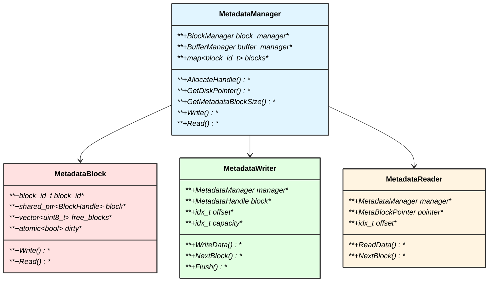
```mermaid
classDiagram
    class MetadataManager {
        **+BlockManager block_manager**
        **+BufferManager buffer_manager**
        **+map~block_id_t~ blocks**
        **+AllocateHandle()**
        **+GetDiskPointer()**
        **+GetMetadataBlockSize()**
        **+Write()**
        **+Read()**
    }
    
    class MetadataBlock {
        **+block_id_t block_id**
        **+shared_ptr~BlockHandle~ block**
        **+vector~uint8_t~ free_blocks**
        **+atomic~bool~ dirty**
        **+Write()**
        **+Read()**
    }
    
    class MetadataWriter {
        **+MetadataManager manager**
        **+MetadataHandle block**
        **+idx_t offset**
        **+idx_t capacity**
        **+WriteData()**
        **+NextBlock()**
        **+Flush()**
    }
    
    class MetadataReader {
        **+MetadataManager manager**
        **+MetaBlockPointer pointer**
        **+idx_t offset**
        **+ReadData()**
        **+NextBlock()**
    }
    
    MetadataManager --> MetadataBlock
    MetadataManager --> MetadataWriter
    MetadataManager --> MetadataReader
    
    style MetadataManager fill:#e1f5ff,stroke:#333,stroke-width:2px,color:#000
    style MetadataBlock fill:#ffe1e1,stroke:#333,stroke-width:2px,color:#000
    style MetadataWriter fill:#e1ffe1,stroke:#333,stroke-width:2px,color:#000
    style MetadataReader fill:#fff4e1,stroke:#333,stroke-width:2px,color:#000
```

### 元数据块布局

每个数据块可以划分为多个**元数据块**（默认64个），每个元数据块大小为：

```
MetadataBlockSize = BlockSize / METADATA_BLOCK_COUNT
                  = 256KB / 64
                  = 4KB
```

**元数据块链表结构：**

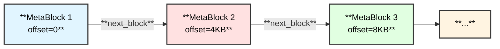
```mermaid
graph LR
    A["**MetaBlock 1<br/>offset=0**"]
    B["**MetaBlock 2<br/>offset=4KB**"]
    C["**MetaBlock 3<br/>offset=8KB**"]
    D["**...**"]
    
    A -->|**next_block**| B
    B -->|**next_block**| C
    C --> D
    
    style A fill:#e1f5ff,stroke:#333,stroke-width:2px,color:#000
    style B fill:#ffe1e1,stroke:#333,stroke-width:2px,color:#000
    style C fill:#e1ffe1,stroke:#333,stroke-width:2px,color:#000
    style D fill:#fff4e1,stroke:#333,stroke-width:2px,color:#000
```

## 行组和列数据组织

### 列式存储架构

DuckDB 采用**列式存储**，以行组（RowGroup）为单位组织数据。

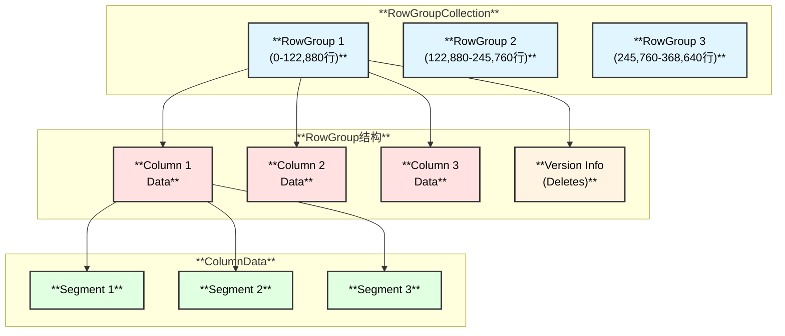
```mermaid
graph TB
    subgraph "**RowGroupCollection**"
        A["**RowGroup 1<br/>(0-122,880行)**"]
        B["**RowGroup 2<br/>(122,880-245,760行)**"]
        C["**RowGroup 3<br/>(245,760-368,640行)**"]
    end
    
    subgraph "**RowGroup结构**"
        D["**Column 1<br/>Data**"]
        E["**Column 2<br/>Data**"]
        F["**Column 3<br/>Data**"]
        G["**Version Info<br/>(Deletes)**"]
    end
    
    subgraph "**ColumnData**"
        H["**Segment 1**"]
        I["**Segment 2**"]
        J["**Segment 3**"]
    end
    
    A --> D
    A --> E
    A --> F
    A --> G
    
    D --> H
    D --> I
    D --> J
    
    style A fill:#e1f5ff,stroke:#333,stroke-width:2px,color:#000
    style B fill:#e1f5ff,stroke:#333,stroke-width:2px,color:#000
    style C fill:#e1f5ff,stroke:#333,stroke-width:2px,color:#000
    style D fill:#ffe1e1,stroke:#333,stroke-width:2px,color:#000
    style E fill:#ffe1e1,stroke:#333,stroke-width:2px,color:#000
    style F fill:#ffe1e1,stroke:#333,stroke-width:2px,color:#000
    style G fill:#fff4e1,stroke:#333,stroke-width:2px,color:#000
    style H fill:#e1ffe1,stroke:#333,stroke-width:2px,color:#000
    style I fill:#e1ffe1,stroke:#333,stroke-width:2px,color:#000
    style J fill:#e1ffe1,stroke:#333,stroke-width:2px,color:#000
```

### RowGroup 设计

**核心特性：**
- **默认大小**：122,880 行（DEFAULT_ROW_GROUP_SIZE）
- **延迟加载**：支持按需加载列数据
- **版本信息**：支持 MVCC 的删除标记

**RowGroup 类结构：**

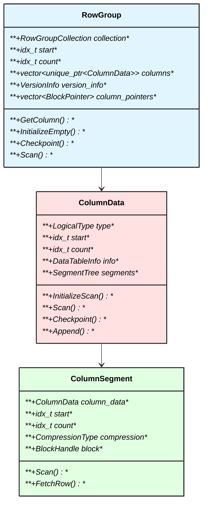
```mermaid
classDiagram
    class RowGroup {
        **+RowGroupCollection collection**
        **+idx_t start**
        **+idx_t count**
        **+vector~unique_ptr~ColumnData~~ columns**
        **+VersionInfo version_info**
        **+vector~BlockPointer~ column_pointers**
        **+GetColumn()**
        **+InitializeEmpty()**
        **+Checkpoint()**
        **+Scan()**
    }
    
    class ColumnData {
        **+LogicalType type**
        **+idx_t start**
        **+idx_t count**
        **+DataTableInfo info**
        **+SegmentTree segments**
        **+InitializeScan()**
        **+Scan()**
        **+Checkpoint()**
        **+Append()**
    }
    
    class ColumnSegment {
        **+ColumnData column_data**
        **+idx_t start**
        **+idx_t count**
        **+CompressionType compression**
        **+BlockHandle block**
        **+Scan()**
        **+FetchRow()**
    }
    
    RowGroup --> ColumnData
    ColumnData --> ColumnSegment
    
    style RowGroup fill:#e1f5ff,stroke:#333,stroke-width:2px,color:#000
    style ColumnData fill:#ffe1e1,stroke:#333,stroke-width:2px,color:#000
    style ColumnSegment fill:#e1ffe1,stroke:#333,stroke-width:2px,color:#000
```

### 列段（ColumnSegment）结构

每个列由多个段（Segment）组成，每个段最多存储一个向量大小的数据。

**段布局：**

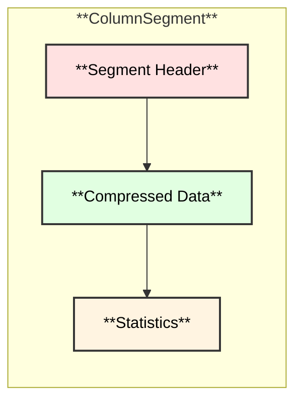
```mermaid
graph LR
    subgraph "**ColumnSegment**"
        A["**Segment Header**"]
        B["**Compressed Data**"]
        C["**Statistics**"]
    end
    
    A --> B
    B --> C
    
    style A fill:#ffe1e1,stroke:#333,stroke-width:2px,color:#000
    style B fill:#e1ffe1,stroke:#333,stroke-width:2px,color:#000
    style C fill:#fff4e1,stroke:#333,stroke-width:2px,color:#000
```

## 压缩设计

DuckDB 支持多种压缩算法，自动选择最优压缩方式。

### 压缩算法

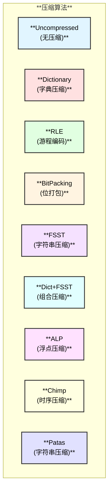
```mermaid
graph TB
    subgraph "**压缩算法**"
        A["**Uncompressed<br/>(无压缩)**"]
        B["**Dictionary<br/>(字典压缩)**"]
        C["**RLE<br/>(游程编码)**"]
        D["**BitPacking<br/>(位打包)**"]
        E["**FSST<br/>(字符串压缩)**"]
        F["**Dict+FSST<br/>(组合压缩)**"]
        G["**ALP<br/>(浮点压缩)**"]
        H["**Chimp<br/>(时序压缩)**"]
        I["**Patas<br/>(字符串压缩)**"]
    end
    
    style A fill:#e1f5ff,stroke:#333,stroke-width:2px,color:#000
    style B fill:#ffe1e1,stroke:#333,stroke-width:2px,color:#000
    style C fill:#e1ffe1,stroke:#333,stroke-width:2px,color:#000
    style D fill:#fff4e1,stroke:#333,stroke-width:2px,color:#000
    style E fill:#f5e1ff,stroke:#333,stroke-width:2px,color:#000
    style F fill:#e1ffff,stroke:#333,stroke-width:2px,color:#000
    style G fill:#ffe1ff,stroke:#333,stroke-width:2px,color:#000
    style H fill:#ffffe1,stroke:#333,stroke-width:2px,color:#000
    style I fill:#e1e1ff,stroke:#333,stroke-width:2px,color:#000
```

### 字典压缩（Dictionary Compression）

字典压缩是最常用的压缩算法之一，特别适合低基数字符串列。

**段布局：**

```
+------------------------------------------------------+
|                  Header                              |
|   +----------------------------------------------+   |
|   |   dictionary_compression_header_t            |   |
|   +----------------------------------------------+   |
+------------------------------------------------------+
|             Selection Buffer                         |
|   +------------------------------------+             |
|   |   uint16_t index_buffer_idx[]      |             |
|   +------------------------------------+             |
|      tuple index -> index buffer idx                 |
+------------------------------------------------------+
|               Index Buffer                           |
|   +------------------------------------+             |
|   |   uint16_t  dictionary_offset[]    |             |
|   +------------------------------------+             |
|  string_index -> offset in the dictionary            |
+------------------------------------------------------+
|                Dictionary                            |
|   +------------------------------------+             |
|   |   uint8_t *raw_string_data         |             |
|   +------------------------------------+             |
|      the string data without lengths                 |
+------------------------------------------------------+
```

### Dict+FSST 组合压缩

对于字符串数据，DuckDB 可以组合使用字典压缩和 FSST 压缩：

```
+------------------------------------------------------+
|                  Header                              |
+------------------------------------------------------+
|             Selection Buffer                         |
+------------------------------------------------------+
|               Index Buffer                           |
+------------------------------------------------------+
|                Dictionary                            |
+------------------------------------------------------+
|             FSST Symbol Table (optional)             |
|   +------------------------------------+             |
|   |   duckdb_fsst_decoder_t table      |             |
|   +------------------------------------+             |
+------------------------------------------------------+
```

## 索引设计

### 索引架构

DuckDB 主要使用 **ART（Adaptive Radix Tree）** 作为索引结构。

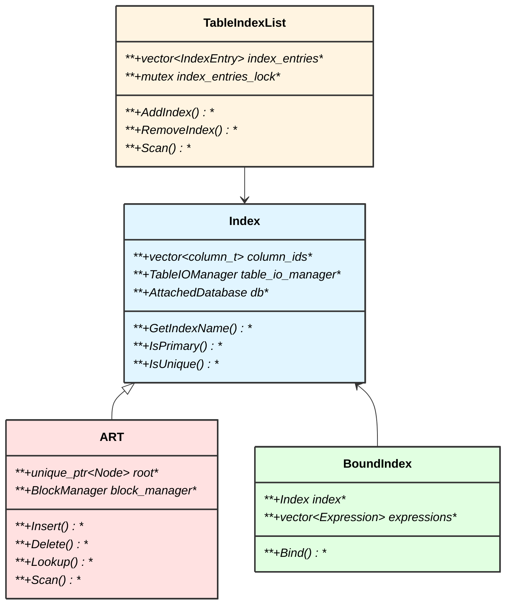
```mermaid
classDiagram
    class Index {
        **+vector~column_t~ column_ids**
        **+TableIOManager table_io_manager**
        **+AttachedDatabase db**
        **+GetIndexName()**
        **+IsPrimary()**
        **+IsUnique()**
    }
    
    class ART {
        **+unique_ptr~Node~ root**
        **+BlockManager block_manager**
        **+Insert()**
        **+Delete()**
        **+Lookup()**
        **+Scan()**
    }
    
    class BoundIndex {
        **+Index index**
        **+vector~Expression~ expressions**
        **+Bind()**
    }
    
    class TableIndexList {
        **+vector~IndexEntry~ index_entries**
        **+mutex index_entries_lock**
        **+AddIndex()**
        **+RemoveIndex()**
        **+Scan()**
    }
    
    Index <|-- ART
    Index <-- BoundIndex
    TableIndexList --> Index
    
    style Index fill:#e1f5ff,stroke:#333,stroke-width:2px,color:#000
    style ART fill:#ffe1e1,stroke:#333,stroke-width:2px,color:#000
    style BoundIndex fill:#e1ffe1,stroke:#333,stroke-width:2px,color:#000
    style TableIndexList fill:#fff4e1,stroke:#333,stroke-width:2px,color:#000
```

### ART 索引特点

**优势：**
1. **自适应**：根据数据分布动态调整节点大小
2. **空间高效**：相比 B+ 树节省内存
3. **缓存友好**：紧凑的节点布局提高缓存命中率
4. **支持范围查询**：保持键的顺序

**索引存储：**
- 索引数据存储在独立的块中
- 支持持久化和恢复
- 使用 BlockManager 管理索引块

## WAL 和 Checkpoint

### Write-Ahead Logging（WAL）

DuckDB 使用 WAL 保证事务的持久性和原子性。

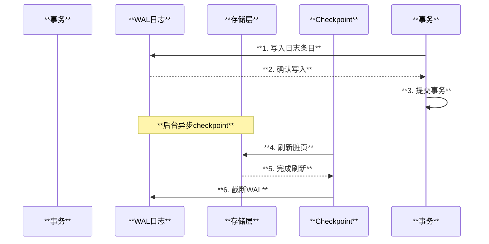
```mermaid
sequenceDiagram
    participant **Transaction** as **事务**
    participant **WAL** as **WAL日志**
    participant **Storage** as **存储层**
    participant **Checkpoint** as **Checkpoint**
    
    **事务**->>**WAL**: **1. 写入日志条目**
    **WAL**-->>**事务**: **2. 确认写入**
    **事务**->>**事务**: **3. 提交事务**
    
    Note over **WAL**,**Storage**: **后台异步checkpoint**
    
    **Checkpoint**->>**Storage**: **4. 刷新脏页**
    **Storage**-->>**Checkpoint**: **5. 完成刷新**
    **Checkpoint**->>**WAL**: **6. 截断WAL**
```

### WAL 记录类型

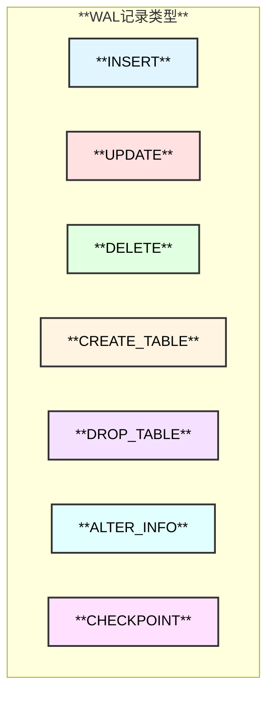
```mermaid
graph TB
    subgraph "**WAL记录类型**"
        A["**INSERT**"]
        B["**UPDATE**"]
        C["**DELETE**"]
        D["**CREATE_TABLE**"]
        E["**DROP_TABLE**"]
        F["**ALTER_INFO**"]
        G["**CHECKPOINT**"]
    end
    
    style A fill:#e1f5ff,stroke:#333,stroke-width:2px,color:#000
    style B fill:#ffe1e1,stroke:#333,stroke-width:2px,color:#000
    style C fill:#e1ffe1,stroke:#333,stroke-width:2px,color:#000
    style D fill:#fff4e1,stroke:#333,stroke-width:2px,color:#000
    style E fill:#f5e1ff,stroke:#333,stroke-width:2px,color:#000
    style F fill:#e1ffff,stroke:#333,stroke-width:2px,color:#000
    style G fill:#ffe1ff,stroke:#333,stroke-width:2px,color:#000
```

### Checkpoint 流程

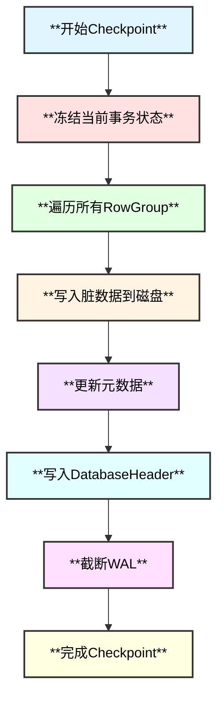
```mermaid
graph TB
    A["**开始Checkpoint**"]
    B["**冻结当前事务状态**"]
    C["**遍历所有RowGroup**"]
    D["**写入脏数据到磁盘**"]
    E["**更新元数据**"]
    F["**写入DatabaseHeader**"]
    G["**截断WAL**"]
    H["**完成Checkpoint**"]
    
    A --> B
    B --> C
    C --> D
    D --> E
    E --> F
    F --> G
    G --> H
    
    style A fill:#e1f5ff,stroke:#333,stroke-width:2px,color:#000
    style B fill:#ffe1e1,stroke:#333,stroke-width:2px,color:#000
    style C fill:#e1ffe1,stroke:#333,stroke-width:2px,color:#000
    style D fill:#fff4e1,stroke:#333,stroke-width:2px,color:#000
    style E fill:#f5e1ff,stroke:#333,stroke-width:2px,color:#000
    style F fill:#e1ffff,stroke:#333,stroke-width:2px,color:#000
    style G fill:#ffe1ff,stroke:#333,stroke-width:2px,color:#000
    style H fill:#ffffe1,stroke:#333,stroke-width:2px,color:#000
```

**Checkpoint 触发条件：**
1. WAL 文件大小超过阈值
2. 显式调用 `CHECKPOINT` 命令
3. 数据库关闭时自动触发

## 统计信息

DuckDB 为每个列段维护统计信息，用于查询优化。

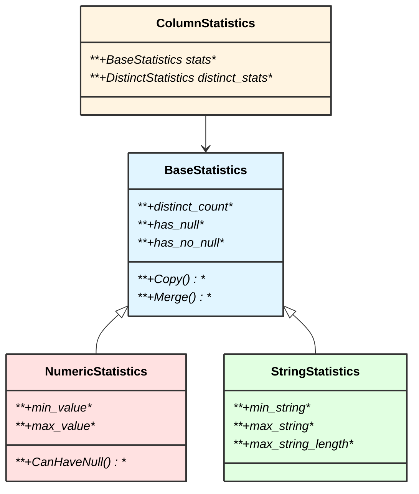
```mermaid
classDiagram
    class BaseStatistics {
        **+distinct_count**
        **+has_null**
        **+has_no_null**
        **+Copy()**
        **+Merge()**
    }
    
    class NumericStatistics {
        **+min_value**
        **+max_value**
        **+CanHaveNull()**
    }
    
    class StringStatistics {
        **+min_string**
        **+max_string**
        **+max_string_length**
    }
    
    class ColumnStatistics {
        **+BaseStatistics stats**
        **+DistinctStatistics distinct_stats**
    }
    
    BaseStatistics <|-- NumericStatistics
    BaseStatistics <|-- StringStatistics
    ColumnStatistics --> BaseStatistics
    
    style BaseStatistics fill:#e1f5ff,stroke:#333,stroke-width:2px,color:#000
    style NumericStatistics fill:#ffe1e1,stroke:#333,stroke-width:2px,color:#000
    style StringStatistics fill:#e1ffe1,stroke:#333,stroke-width:2px,color:#000
    style ColumnStatistics fill:#fff4e1,stroke:#333,stroke-width:2px,color:#000
```

**统计信息用途：**
1. **谓词下推**：根据 min/max 值跳过不相关的段
2. **连接优化**：选择更小的表作为构建端
3. **聚合优化**：使用统计信息估算结果大小

## 存储优化技术

### 1. 向量化处理

DuckDB 使用向量化执行引擎，默认向量大小为 **2048**：

```cpp
#define STANDARD_VECTOR_SIZE 2048
```

### 2. 列裁剪

只读取查询需要的列，减少 I/O：

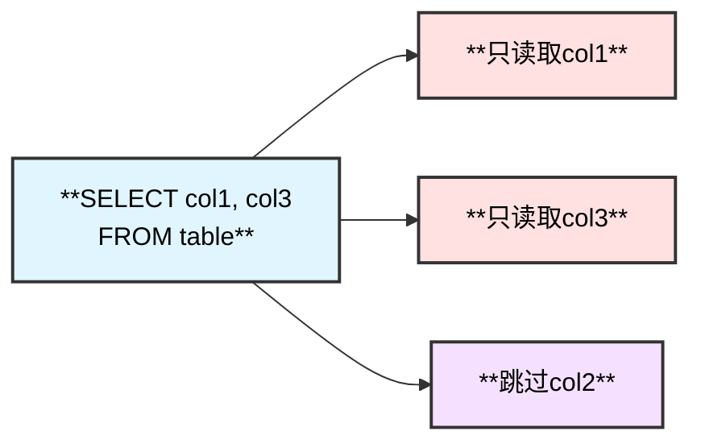
```mermaid
graph LR
    A["**SELECT col1, col3<br/>FROM table**"]
    B["**只读取col1**"]
    C["**只读取col3**"]
    D["**跳过col2**"]
    
    A --> B
    A --> C
    A --> D
    
    style A fill:#e1f5ff,stroke:#333,stroke-width:2px,color:#000
    style B fill:#ffe1e1,stroke:#333,stroke-width:2px,color:#000
    style C fill:#ffe1e1,stroke:#333,stroke-width:2px,color:#000
    style D fill:#f5e1ff,stroke:#333,stroke-width:2px,color:#000
```

### 3. Zone Maps

使用段级别的 min/max 统计信息实现 Zone Maps：

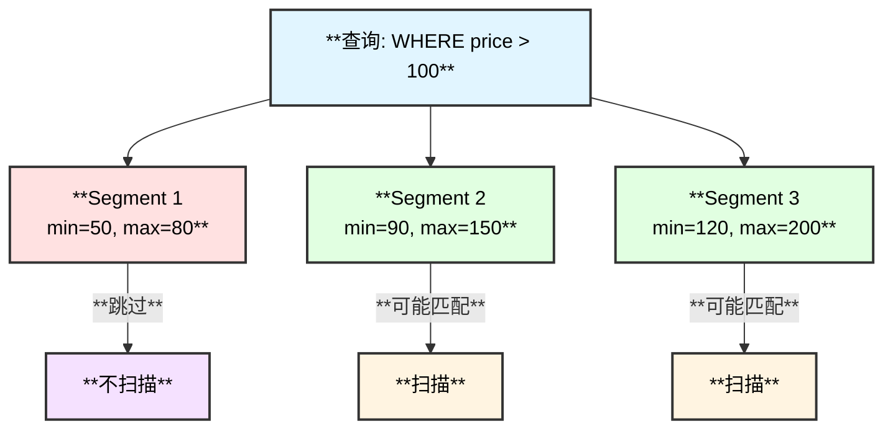
```mermaid
graph TB
    A["**查询: WHERE price > 100**"]
    B["**Segment 1<br/>min=50, max=80**"]
    C["**Segment 2<br/>min=90, max=150**"]
    D["**Segment 3<br/>min=120, max=200**"]
    
    A --> B
    A --> C
    A --> D
    
    B -->|**跳过**| E["**不扫描**"]
    C -->|**可能匹配**| F["**扫描**"]
    D -->|**可能匹配**| G["**扫描**"]
    
    style A fill:#e1f5ff,stroke:#333,stroke-width:2px,color:#000
    style B fill:#ffe1e1,stroke:#333,stroke-width:2px,color:#000
    style C fill:#e1ffe1,stroke:#333,stroke-width:2px,color:#000
    style D fill:#e1ffe1,stroke:#333,stroke-width:2px,color:#000
    style E fill:#f5e1ff,stroke:#333,stroke-width:2px,color:#000
    style F fill:#fff4e1,stroke:#333,stroke-width:2px,color:#000
    style G fill:#fff4e1,stroke:#333,stroke-width:2px,color:#000
```

### 4. 延迟物化

在列式存储中，延迟物化可以显著减少数据移动：

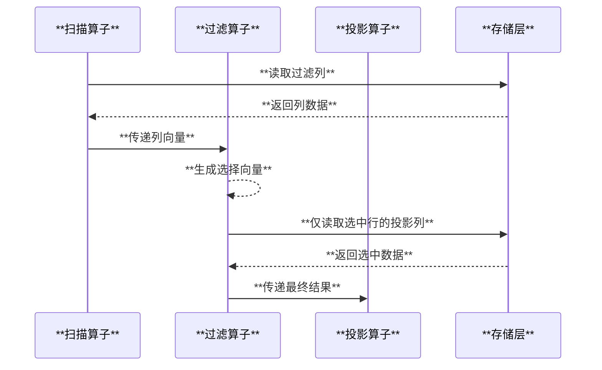
```mermaid
sequenceDiagram
    participant **Scan** as **扫描算子**
    participant **Filter** as **过滤算子**
    participant **Project** as **投影算子**
    participant **Storage** as **存储层**
    
    **Scan**->>**Storage**: **读取过滤列**
    **Storage**-->>**Scan**: **返回列数据**
    **Scan**->>**Filter**: **传递列向量**
    **Filter**-->>**Filter**: **生成选择向量**
    **Filter**->>**Storage**: **仅读取选中行的投影列**
    **Storage**-->>**Filter**: **返回选中数据**
    **Filter**->>**Project**: **传递最终结果**
```

## 核心数据结构总结

### 存储层次关系

```mermaid
graph TB
    A["**StorageManager**"]
    B["**BlockManager**"]
    C["**DataTable**"]
    D["**RowGroupCollection**"]
    E["**RowGroup**"]
    F["**ColumnData**"]
    G["**ColumnSegment**"]
    
    A --> B
    A --> C
    C --> D
    D --> E
    E --> F
    F --> G
    
    H["**BufferManager**"]
    I["**BufferPool**"]
    J["**BlockHandle**"]
    
    A --> H
    H --> I
    B --> J
    I --> J
    
    K["**MetadataManager**"]
    L["**MetadataBlock**"]
    
    B --> K
    K --> L
    
    style A fill:#e1f5ff,stroke:#333,stroke-width:2px,color:#000
    style B fill:#ffe1e1,stroke:#333,stroke-width:2px,color:#000
    style C fill:#e1ffe1,stroke:#333,stroke-width:2px,color:#000
    style D fill:#fff4e1,stroke:#333,stroke-width:2px,color:#000
    style E fill:#f5e1ff,stroke:#333,stroke-width:2px,color:#000
    style F fill:#e1ffff,stroke:#333,stroke-width:2px,color:#000
    style G fill:#ffe1ff,stroke:#333,stroke-width:2px,color:#000
    style H fill:#ffffe1,stroke:#333,stroke-width:2px,color:#000
    style I fill:#e1e1ff,stroke:#333,stroke-width:2px,color:#000
    style J fill:#ffe1e1,stroke:#333,stroke-width:2px,color:#000
    style K fill:#e1ffe1,stroke:#333,stroke-width:2px,color:#000
    style L fill:#fff4e1,stroke:#333,stroke-width:2px,color:#000
```

## 总结

DuckDB 的底层存储设计体现了现代分析型数据库的最佳实践：

1. **列式存储** - 优化分析查询性能
2. **多种压缩算法** - 自动选择最优压缩方式
3. **向量化执行** - 充分利用现代 CPU 特性
4. **统计信息** - 支持智能查询优化
5. **WAL + Checkpoint** - 保证数据持久性和一致性
6. **单文件架构** - 简化部署和管理
7. **Zone Maps** - 高效的数据跳过策略
8. **延迟物化** - 减少不必要的数据移动

这些设计使得 DuckDB 能够在嵌入式场景下提供接近大型分析数据库的性能。

## 相关源码文件

### 核心存储文件
- `src/storage/storage_manager.cpp` - 存储管理器
- `src/storage/block_manager.cpp` - 块管理器
- `src/storage/buffer/block_handle.cpp` - 块句柄
- `src/storage/buffer/buffer_manager.cpp` - 缓冲管理器
- `src/include/duckdb/storage/storage_info.hpp` - 存储常量定义

### 元数据文件
- `src/storage/metadata/metadata_manager.cpp` - 元数据管理器
- `src/storage/metadata/metadata_writer.cpp` - 元数据写入器
- `src/storage/metadata/metadata_reader.cpp` - 元数据读取器

### 行组和列数据
- `src/storage/table/row_group.cpp` - 行组实现
- `src/storage/table/column_data.cpp` - 列数据实现
- `src/storage/table/column_segment.cpp` - 列段实现

### 压缩
- `src/storage/compression/dictionary_compression.cpp` - 字典压缩
- `src/storage/compression/dict_fsst.cpp` - Dict+FSST 压缩
- `src/storage/compression/rle.cpp` - RLE 压缩
- `src/storage/compression/bitpacking.cpp` - 位打包压缩

### WAL 和 Checkpoint
- `src/storage/write_ahead_log.cpp` - WAL 实现
- `src/storage/checkpoint_manager.cpp` - Checkpoint 管理器
- `src/storage/wal_replay.cpp` - WAL 重放

### 索引
- `src/storage/index.cpp` - 索引基类
- `src/execution/index/art/` - ART 索引实现

