# **DuckDB 存储与事务系统深度分析**

## **概述**

DuckDB 采用现代化的存储架构，结合MVCC事务管理、WAL预写日志、检查点机制和高效的缓冲区管理，为分析型工作负载提供了高性能、高可靠性的数据存储解决方案。本文档基于源码深入分析DuckDB存储系统的各个核心组件。

---

## **1. 整体存储架构**

DuckDB的存储系统采用分层设计，从上到下包含事务层、存储管理层、缓冲区管理层和文件系统抽象层。

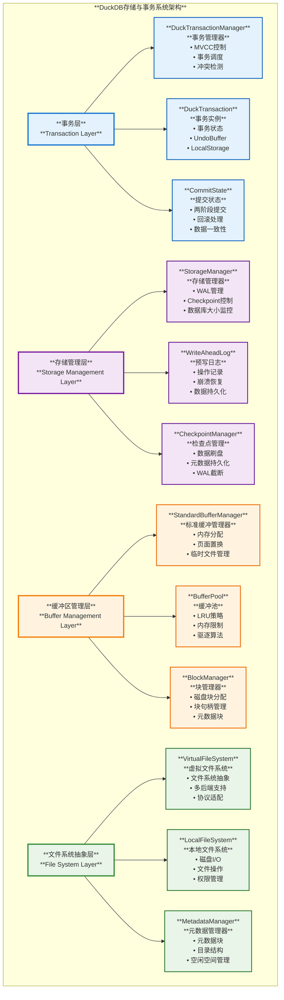

---

## **2. 事务管理与MVCC机制**

DuckDB采用多版本并发控制（MVCC）来实现高性能的事务隔离和并发访问。

### **2.1 事务管理架构**

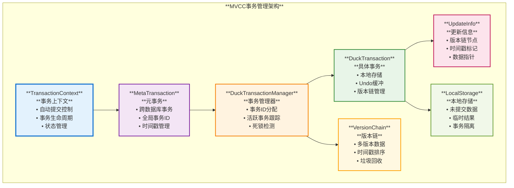

### **2.2 MVCC实现原理**

#### **时间戳分配机制**
**源码位置**: `src/transaction/duck_transaction_manager.cpp`

```cpp
Transaction &DuckTransactionManager::StartTransaction(ClientContext &context) {
    // 获取启动时间戳和事务ID
    transaction_t start_time = current_start_timestamp++;
    transaction_t transaction_id = current_transaction_id++;
    
    // 创建事务实例
    auto transaction = make_uniq<DuckTransaction>(*this, context, start_time, transaction_id);
    active_transactions.push_back(std::move(transaction));
    return transaction_ref;
}
```

**关键特性**:
- **递增时间戳**: 确保事务的时序关系
- **事务ID分配**: 从`TRANSACTION_ID_START`开始分配
- **活跃事务跟踪**: 维护最低活跃事务时间戳

#### **版本链管理**
**源码位置**: `src/storage/table/update_segment.cpp`

**更新冲突检测**:
```cpp
static void CheckForConflicts(UndoBufferPointer next_ptr, TransactionData transaction, 
                              row_t *ids, const SelectionVector &sel, idx_t count) {
    while (next_ptr.IsSet()) {
        auto &info = UpdateInfo::Get(pin);
        if (info.version_number == transaction.transaction_id) {
            // 当前事务的更新
        } else if (info.version_number > transaction.start_time) {
            // 潜在冲突检测
            throw TransactionException("Conflict on update!");
        }
        next_ptr = info.next;
    }
}
```

**MVCC优势**:
- **读不阻塞写**: 读操作不会阻塞写操作
- **写不阻塞读**: 写操作不会阻塞读操作
- **快照隔离**: 每个事务看到一致的数据快照
- **无锁读取**: 大多数读操作无需获取锁

### **2.3 事务状态与生命周期**

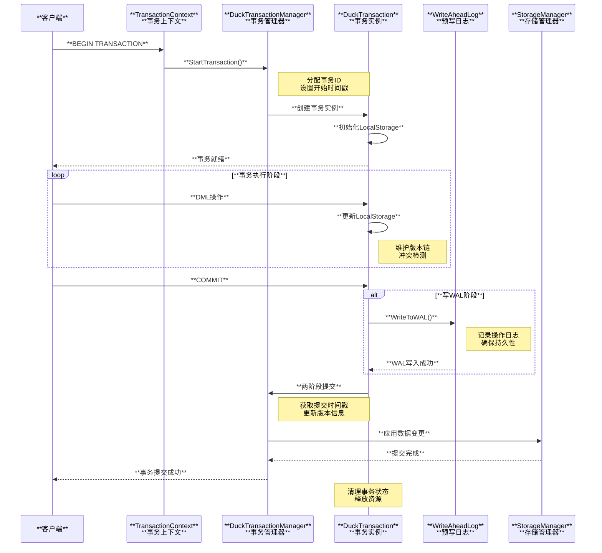

---

## **3. WAL预写日志系统**

WAL系统是DuckDB数据持久性和崩溃恢复的核心组件。

### **3.1 WAL架构与实现**

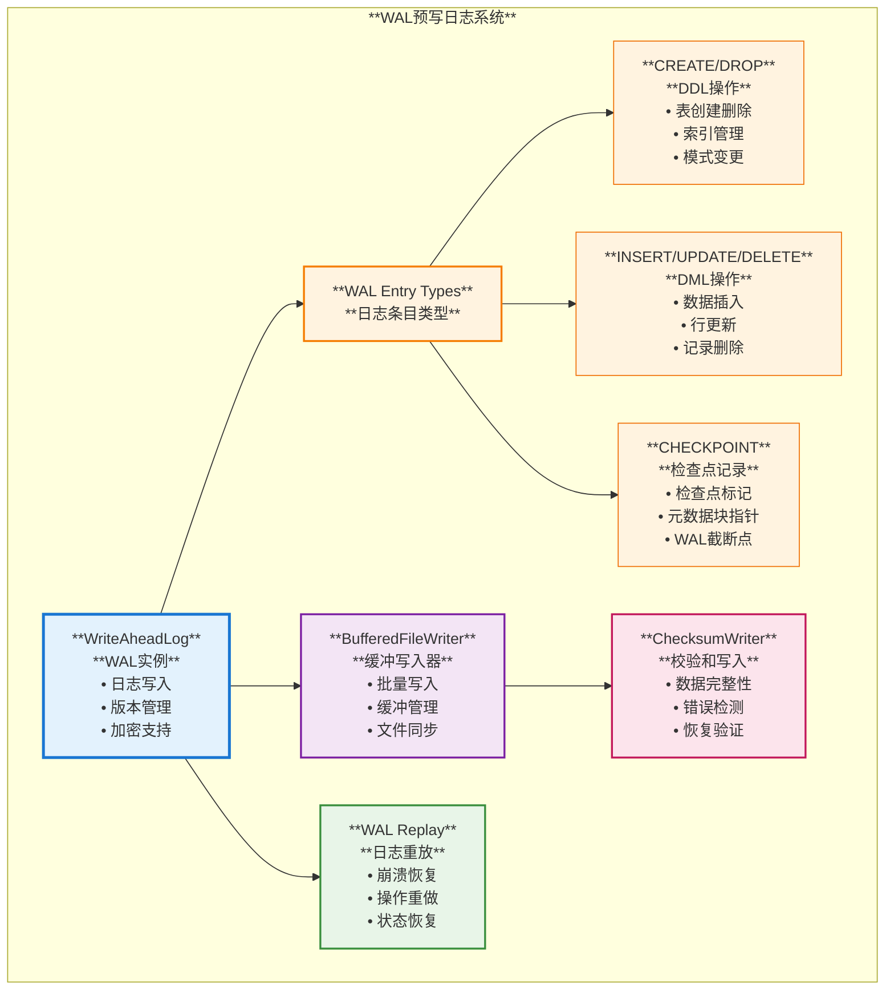

### **3.2 WAL写入流程**

**源码位置**: `src/storage/write_ahead_log.cpp`

#### **WAL初始化**
```cpp
BufferedFileWriter &WriteAheadLog::Initialize() {
    if (!writer) {
        writer = make_uniq<BufferedFileWriter>(
            FileSystem::Get(database), wal_path,
            FileFlags::FILE_FLAGS_WRITE | FileFlags::FILE_FLAGS_APPEND
        );
        WriteVersion(); // 写入WAL版本号
    }
    return *writer;
}
```

#### **事务提交WAL写入**
**源码位置**: `src/transaction/duck_transaction.cpp`

```cpp
ErrorData DuckTransaction::WriteToWAL(AttachedDatabase &db, 
                                       unique_ptr<StorageCommitState> &commit_state) {
    auto &storage_manager = db.GetStorageManager();
    auto log = storage_manager.GetWAL();
    
    // 生成存储提交状态
    commit_state = storage_manager.GenStorageCommitState(*log);
    
    // 提交本地存储到WAL
    storage->Commit(commit_state.get());
    
    // 写入Undo缓冲区到WAL
    undo_buffer.WriteToWAL(*log, commit_state.get());
    
    return ErrorData();
}
```

#### **WAL条目格式**
每个WAL条目包含：
- **长度字段**: 条目大小
- **校验和**: 数据完整性验证
- **条目类型**: CREATE_TABLE, INSERT, UPDATE等
- **数据载荷**: 具体的操作数据

### **3.3 崩溃恢复机制**

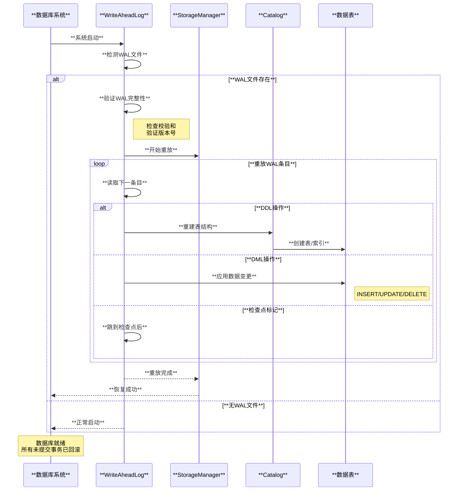

**恢复保证**:
- **原子性**: 部分提交的事务将被回滚
- **一致性**: 恢复后数据库状态一致
- **持久性**: 已提交事务的更改得到保留
- **隔离性**: 恢复过程不影响新事务

---

## **4. Checkpoint检查点机制**

检查点机制定期将内存中的数据刷入磁盘，减少恢复时间并管理WAL大小。

### **4.1 检查点类型与策略**

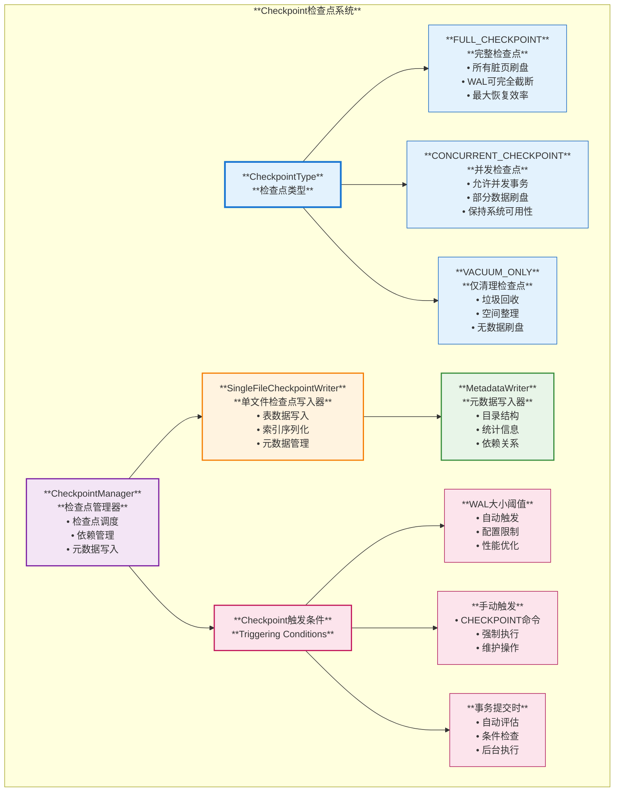

### **4.2 检查点执行流程**

**源码位置**: `src/storage/storage_manager.cpp`

#### **检查点决策逻辑**
```cpp
DuckTransactionManager::CheckpointDecision 
DuckTransactionManager::CanCheckpoint(DuckTransaction &transaction) {
    // 检查是否可以执行检查点
    if (transaction.IsReadOnly()) {
        return CheckpointDecision("transaction is read-only");
    }
    
    // 尝试获取检查点锁
    auto lock = transaction.TryGetCheckpointLock();
    if (!lock) {
        return CheckpointDecision("Failed to obtain checkpoint lock");
    }
    
    // 根据条件决定检查点类型
    auto checkpoint_type = CheckpointType::FULL_CHECKPOINT;
    if (undo_properties.has_updates || undo_properties.has_deletes) {
        checkpoint_type = CheckpointType::CONCURRENT_CHECKPOINT;
    }
    
    return CheckpointDecision(checkpoint_type);
}
```

#### **检查点创建过程**
**源码位置**: `src/storage/checkpoint_manager.cpp`

```cpp
void SingleFileCheckpointWriter::CreateCheckpoint() {
    // 设置元数据写入器
    metadata_writer = make_uniq<MetadataWriter>(metadata_manager);
    table_metadata_writer = make_uniq<MetadataWriter>(metadata_manager);
    
    // 获取目录条目
    vector<reference<SchemaCatalogEntry>> schemas;
    catalog.ScanSchemas([&](SchemaCatalogEntry &entry) { 
        schemas.push_back(entry); 
    });
    
    // 重排序依赖关系
    catalog_entry_vector_t catalog_entries = GetCatalogEntries(schemas);
    dependency_manager.ReorderEntries(catalog_entries);
    
    // 序列化写入磁盘
    BinarySerializer serializer(*metadata_writer);
    serializer.WriteList(schemas.size(), [&](Serializer::List &list, idx_t i) {
        WriteSchema(list, schemas[i]);
    });
}
```

### **4.3 检查点与WAL协调**

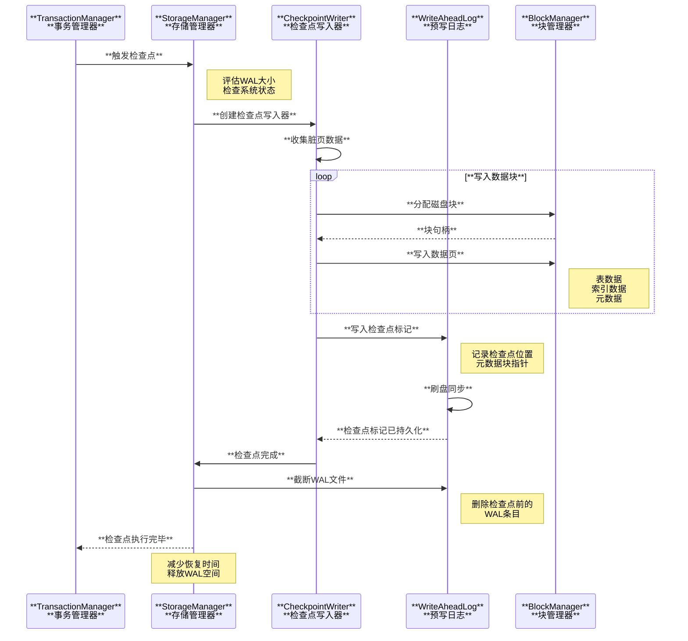

**检查点优化策略**:
- **增量检查点**: 只写入自上次检查点以来的变更
- **并发检查点**: 允许事务在检查点期间继续执行
- **压缩优化**: 使用列式压缩减少磁盘占用
- **后台执行**: 检查点在后台异步执行

---

## **5. Buffer管理与内存优化**

DuckDB的Buffer管理系统负责高效的内存分配、页面置换和临时数据管理。

### **5.1 Buffer管理架构**

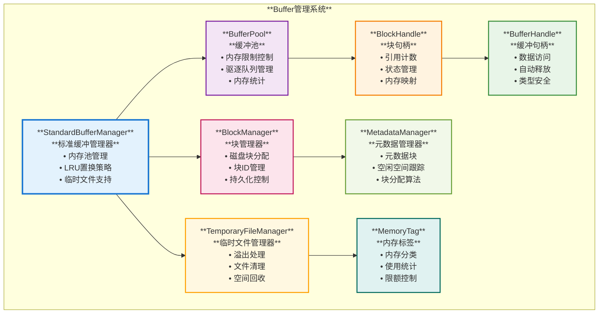

### **5.2 内存分配与页面置换**

**源码位置**: `src/storage/standard_buffer_manager.cpp`

#### **内存分配策略**
```cpp
BufferHandle StandardBufferManager::Pin(shared_ptr<BlockHandle> &handle) {
    // 锁定块句柄
    auto lock = handle->GetLock();
    
    if (handle->GetState() == BlockState::BLOCK_LOADED) {
        // 块已加载，直接返回
        return handle->Load();
    }
    
    // 需要从磁盘加载，先驱逐足够的内存
    idx_t required_memory = handle->GetMemoryUsage();
    
    // 驱逐算法：LRU + 内存压力感知
    while (GetUsedMemory() + required_memory > GetMaxMemory()) {
        if (!EvictBlocks(required_memory)) {
            // 无法驱逐足够内存，使用临时文件
            WriteTemporaryBuffer(handle);
            break;
        }
    }
    
    // 分配内存并加载数据
    auto buffer = AllocateBuffer(required_memory);
    LoadFromDisk(handle, buffer);
    return BufferHandle(handle, buffer);
}
```

#### **LRU驱逐算法**
```cpp
bool StandardBufferManager::EvictBlocks(idx_t memory_requirement) {
    lock_guard<mutex> evict_lock(eviction_lock);
    
    idx_t freed_memory = 0;
    auto current = eviction_queue.GetTail();
    
    while (current && freed_memory < memory_requirement) {
        auto block_handle = current->handle;
        
        if (block_handle.use_count() > 1) {
            // 仍有引用，跳过
            current = current->prev;
            continue;
        }
        
        // 执行驱逐
        if (block_handle->dirty) {
            WriteBlockToDisk(block_handle);
        }
        
        freed_memory += block_handle->memory_usage;
        eviction_queue.Remove(current);
        current = current->prev;
    }
    
    return freed_memory >= memory_requirement;
}
```

### **5.3 临时文件管理**

**临时数据处理策略**:
- **内存优先**: 优先使用内存存储中间结果
- **智能溢出**: 内存不足时溢出到临时文件
- **分块处理**: 大型数据集分块处理
- **自动清理**: 查询结束后自动清理临时文件

**源码位置**: `src/storage/temporary_file_manager.cpp`

```cpp
class TemporaryFileManager {
    // 创建临时文件用于溢出
    unique_ptr<FileBuffer> WriteTemporaryBuffer(BufferHandle &buffer) {
        auto temp_file = CreateTemporaryFile();
        temp_file->Write(buffer.Ptr(), buffer.GetSize());
        
        // 跟踪临时文件用于清理
        temporary_files.push_back(std::move(temp_file));
        return buffer;
    }
    
    // 查询结束时清理临时文件
    ~TemporaryFileManager() {
        for (auto &file : temporary_files) {
            filesystem.RemoveFile(file->GetPath());
        }
    }
};
```

---

## **6. 文件系统抽象层**

DuckDB通过虚拟文件系统提供统一的文件访问接口，支持多种存储后端。

### **6.1 文件系统架构**

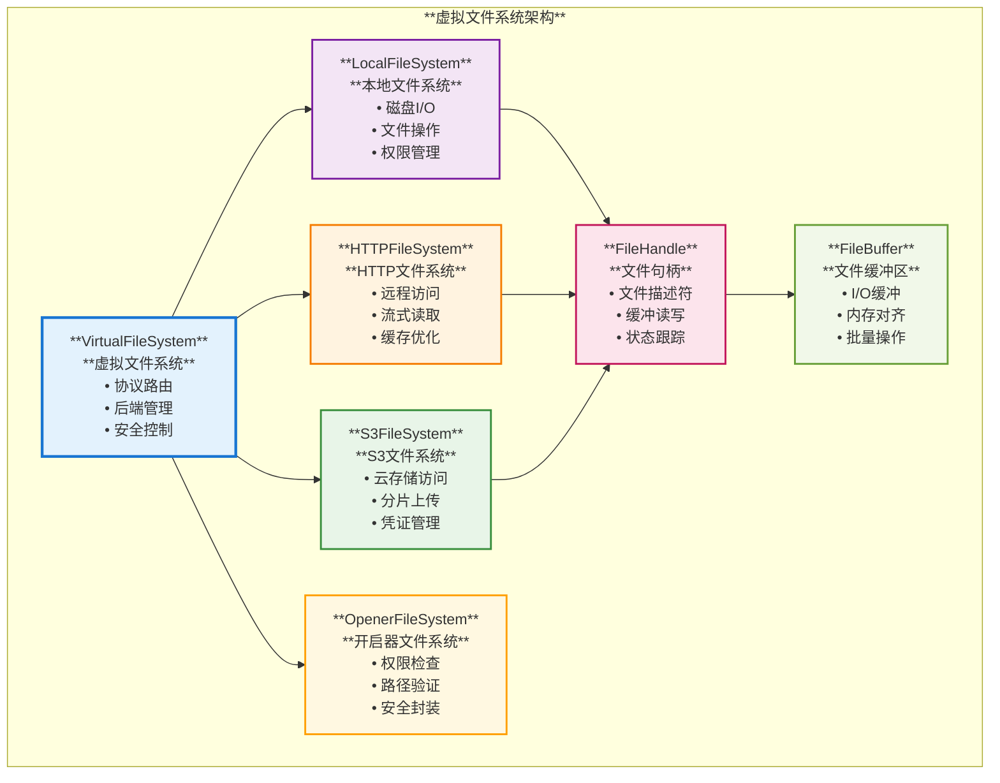

### **6.2 文件系统实现**

**源码位置**: `src/common/file_system.cpp`

#### **统一文件接口**
```cpp
class FileSystem {
public:
    // 文件操作接口
    virtual unique_ptr<FileHandle> OpenFile(const string &path, FileOpenFlags flags);
    virtual void Read(FileHandle &handle, void *buffer, int64_t nr_bytes, idx_t location);
    virtual void Write(FileHandle &handle, void *buffer, int64_t nr_bytes, idx_t location);
    virtual int64_t GetFileSize(FileHandle &handle);
    virtual void Truncate(FileHandle &handle, int64_t new_size);
    
    // 目录操作
    virtual bool DirectoryExists(const string &directory);
    virtual void CreateDirectory(const string &directory);
    virtual vector<string> ListFiles(const string &directory);
    
    // 文件系统特性
    virtual bool CanHandleFile(const string &path);
    virtual string GetName() const = 0;
};
```

#### **虚拟文件系统路由**
**源码位置**: `src/common/virtual_file_system.cpp`

```cpp
FileSystem &VirtualFileSystem::FindFileSystem(const string &path) {
    // 根据路径前缀选择合适的文件系统
    for (auto &sub_system : sub_systems) {
        if (sub_system->CanHandleFile(path)) {
            if (sub_system->IsManuallySet()) {
                return *sub_system;  // 手动设置的优先
            }
            fs = sub_system.get();
        }
    }
    
    if (fs) {
        return *fs;
    }
    return *default_fs;  // 默认使用本地文件系统
}
```

**协议支持**:
- **file://**: 本地文件系统
- **http://**: HTTP远程文件
- **https://**: HTTPS安全访问  
- **s3://**: Amazon S3云存储
- **gcs://**: Google Cloud Storage
- **azure://**: Azure Blob Storage

### **6.3 性能优化策略**

**I/O优化**:
- **预取机制**: 预测性数据读取
- **异步I/O**: 非阻塞文件操作
- **批量操作**: 合并小的I/O请求
- **缓存策略**: 智能文件系统缓存

**网络优化**:
- **范围读取**: HTTP Range requests
- **连接复用**: Keep-alive连接
- **压缩传输**: Gzip/LZ4压缩
- **重试机制**: 网络故障恢复

---

## **7. 元数据管理系统**

DuckDB的元数据管理系统负责维护数据库的结构信息、统计数据和系统配置。

### **7.1 元数据架构**

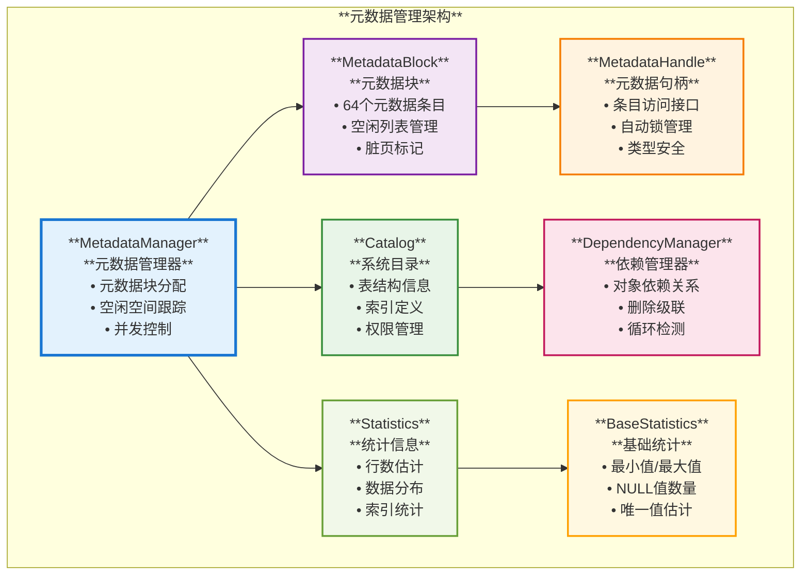

### **7.2 元数据存储实现**

**源码位置**: `src/storage/metadata/metadata_manager.cpp`

#### **元数据块分配**
```cpp
MetadataHandle MetadataManager::AllocateHandle() {
    // 查找有空闲空间的元数据块
    block_id_t free_block = INVALID_BLOCK;
    for (auto &kv : blocks) {
        auto &block = kv.second;
        if (!block.free_blocks.empty()) {
            free_block = kv.first;
            break;
        }
    }
    
    // 如果没有空闲块，分配新块
    if (free_block == INVALID_BLOCK) {
        free_block = AllocateNewBlock();
    }
    
    // 分配元数据条目
    MetadataPointer pointer;
    pointer.block_index = free_block;
    auto &block = blocks[free_block];
    pointer.index = block.free_blocks.back();
    block.free_blocks.pop_back();
    
    return Pin(pointer);
}
```

#### **元数据持久化**
```cpp
void MetadataManager::Flush() {
    const idx_t total_metadata_size = GetMetadataBlockSize() * METADATA_BLOCK_COUNT;
    
    for (auto &kv : blocks) {
        auto &block = kv.second;
        if (!block.dirty) {
            continue;  // 跳过未修改的块
        }
        
        auto handle = buffer_manager.Pin(block.block);
        
        if (block.block->BlockId() >= MAXIMUM_BLOCK) {
            // 临时块转换为持久块
            block.block = block_manager.ConvertToPersistent(
                QueryContext(), kv.first, std::move(block.block), std::move(handle)
            );
        } else {
            // 写入已存在的持久块
            block_manager.Write(QueryContext(), handle.GetFileBuffer(), block.block_id);
        }
        
        block.dirty = false;
    }
}
```

**元数据特性**:
- **分块管理**: 每个元数据块包含64个条目
- **空闲跟踪**: 高效的空闲空间位图管理
- **并发安全**: 细粒度锁保证并发访问安全
- **写时复制**: 支持事务性元数据修改

---

## **8. 系统整体协调与优化**

### **8.1 组件协调机制**

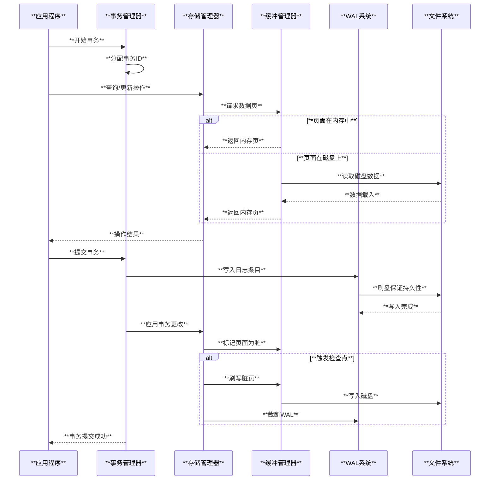

### **8.2 性能监控与调优**

**关键性能指标**:
- **缓冲池命中率**: 内存访问效率
- **WAL写入延迟**: 事务提交性能
- **检查点频率**: 系统稳定性
- **临时文件使用**: 内存压力指标

**自适应优化策略**:
- **动态内存分配**: 根据工作负载调整缓冲池大小
- **智能检查点调度**: 基于系统负载和WAL大小
- **预取优化**: 根据访问模式预取数据
- **压缩策略**: 动态选择最优压缩算法

---

## **9. 总结与展望**

### **9.1 架构优势**

**可靠性保证**:
- **ACID事务**: 完整的事务ACID属性支持
- **崩溃恢复**: 基于WAL的快速恢复机制
- **数据一致性**: MVCC保证读写一致性
- **故障容错**: 多层次的错误检测和恢复

**性能优化**:
- **内存高效**: 智能的缓冲区管理和LRU策略
- **并发友好**: 无锁MVCC和细粒度锁控制
- **I/O优化**: 异步I/O、预取和批量操作
- **存储效率**: 列式压缩和增量检查点

**扩展性支持**:
- **模块化设计**: 清晰的组件分离和接口定义
- **文件系统抽象**: 支持多种存储后端
- **可配置参数**: 丰富的调优参数和策略选择
- **插件架构**: 支持自定义文件系统和存储引擎

### **9.2 技术创新点**

1. **轻量级MVCC**: 针对分析型工作负载优化的MVCC实现
2. **智能检查点**: 多类型检查点策略和并发执行
3. **自适应缓冲**: 基于工作负载特征的内存管理
4. **统一文件系统**: 透明支持本地和云存储
5. **增量元数据**: 高效的元数据增量更新机制

### **9.3 应用场景**

**适用场景**:
- **数据分析**: OLAP查询和复杂分析
- **机器学习**: 特征工程和模型训练数据准备  
- **数据科学**: 探索性数据分析和可视化
- **边缘计算**: 嵌入式分析和实时处理

**性能优势**:
- **快速启动**: 轻量级设计，毫秒级启动
- **高并发**: 支持大量并发分析查询
- **内存高效**: 智能内存管理，适应各种环境
- **扩展性好**: 从小型设备到大型服务器的全覆盖

DuckDB的存储与事务系统展现了现代分析型数据库的设计理念，通过精心设计的架构和优化策略，在保证数据可靠性的同时实现了卓越的性能表现，为各种分析场景提供了理想的数据处理平台。
