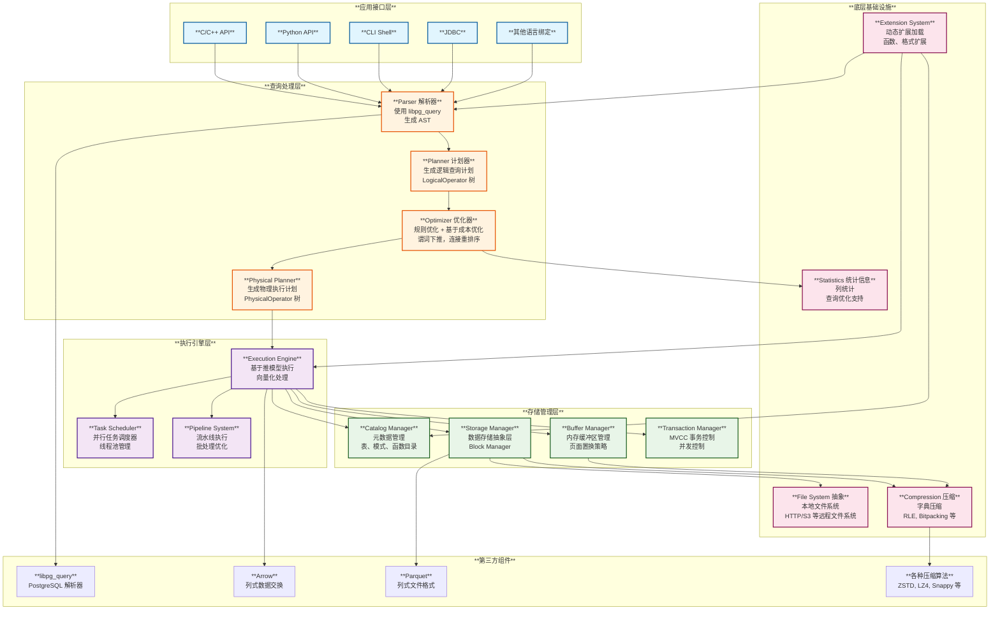
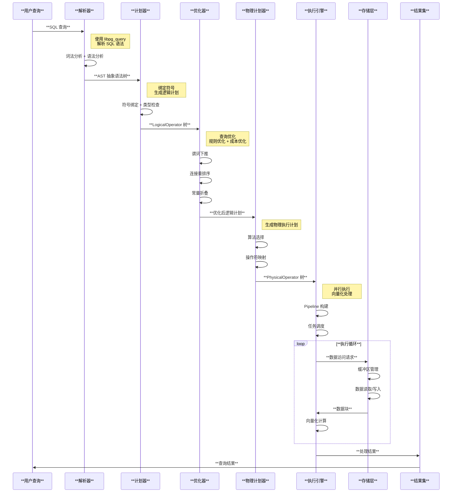
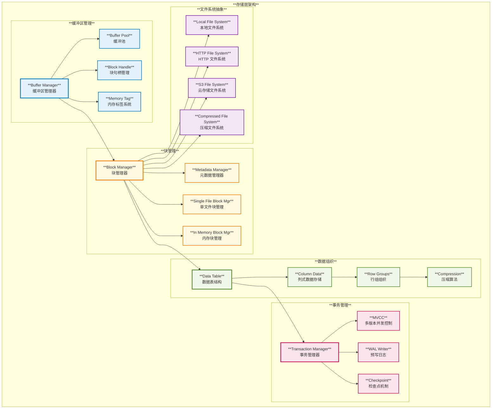

# **DuckDB 架构分析报告**

## **概述**

DuckDB 是一个高性能的分析型数据库管理系统，采用列式存储和向量化执行引擎。本报告基于源码分析，详细阐述了 DuckDB 的整体架构、核心模块以及关键技术原理。

---

## **1. 整体架构**

DuckDB 采用分层设计，从上到下包含应用接口层、查询处理层、执行引擎层、存储管理层和底层基础设施。

---

## **2. 查询执行流程**

DuckDB 的查询处理遵循经典的数据库查询处理流程，但在每个环节都进行了针对分析型工作负载的优化。

### **2.1 解析器 (Parser)**

**位置**: `src/parser/`

**核心功能**:
- 使用 PostgreSQL 的 libpg_query 库进行 SQL 解析
- 将 SQL 字符串转换为抽象语法树 (AST)
- 构建基于 `SQLStatements`、`Expressions` 和 `TableRefs` 的自定义解析树

**关键特点**:
- 兼容 PostgreSQL SQL 语法
- 支持复杂的分析型 SQL 语句
- 高效的错误检测和报告

### **2.2 计划器 (Planner)**

**位置**: `src/planner/`

**核心功能**:
- 符号绑定：将表名、列名等符号解析为实际的数据库对象
- 类型检查和推导
- 生成逻辑查询计划，以 `LogicalOperator` 树的形式表示

**关键组件**:
- **Binder**: 负责符号绑定和语义分析
- **LogicalOperator**: 逻辑操作符的基类，包含各种逻辑操作
- **Expression**: 表达式系统，支持复杂的表达式计算

### **2.3 优化器 (Optimizer)**

**位置**: `src/optimizer/`

**核心功能**:
- 规则优化：应用预定义的优化规则
- 基于成本的优化：选择最优的执行计划
- 主要优化技术包括谓词下推、表达式重写、连接重排序

**关键优化策略**:
- **谓词下推**: 将过滤条件尽可能推到数据源附近
- **连接重排序**: 基于统计信息选择最优的连接顺序
- **常量折叠**: 编译时计算常量表达式
- **列剪枝**: 只读取查询需要的列

### **2.4 执行引擎 (Execution Engine)**

**位置**: `src/execution/`

**核心功能**:
- 将逻辑计划转换为物理执行计划
- 向量化执行：批量处理数据，提高 CPU 缓存利用率
- 并行执行：利用多核 CPU 并行处理

**执行模型**:
- **推模式 (Push-based)**: 数据从叶子节点向根节点推送
- **向量化处理**: 使用向量 (Vector) 作为基本数据单元
- **Pipeline 执行**: 将操作符组织成流水线，减少物化开销

---

## **3. 存储层架构**

DuckDB 的存储层设计为支持高效的分析型查询，采用列式存储和先进的压缩技术。

### **3.1 缓冲区管理**

**位置**: `src/storage/buffer/`

**核心组件**:
- **StandardBufferManager**: 标准缓冲区管理器，实现 LRU 页面置换策略
- **BufferPool**: 缓冲池管理，维护内存中的数据页
- **BlockHandle**: 数据块句柄，提供对数据块的抽象访问

**关键特性**:
- 智能内存管理：动态调整缓冲区大小
- 多级缓存策略：支持不同优先级的数据缓存
- 内存标签系统：跟踪不同类型数据的内存使用

### **3.2 数据存储**

**位置**: `src/storage/`

**数据组织**:
- **列式存储**: 数据按列存储，提高分析查询性能
- **行组 (Row Groups)**: 将数据分组，平衡扫描效率和更新性能
- **压缩算法**: 支持多种压缩算法（字典压缩、RLE、Bitpacking 等）

**压缩技术**:
- **字典压缩**: 适用于重复值较多的列
- **Run-Length Encoding (RLE)**: 适用于连续重复值
- **Bitpacking**: 适用于数值范围较小的列
- **Delta 编码**: 适用于有序数据

### **3.3 事务管理**

**位置**: `src/transaction/`

**事务特性**:
- **MVCC (多版本并发控制)**: 支持高并发读写
- **ACID 属性**: 保证事务的原子性、一致性、隔离性和持久性
- **预写日志 (WAL)**: 确保数据持久性和故障恢复
- **检查点机制**: 定期将内存数据持久化到磁盘

---

## **4. 核心技术特性**

### **4.1 向量化执行**

DuckDB 采用向量化执行模型，将数据组织成向量（通常包含 1024 个元组），批量执行操作：

**优势**:
- 提高 CPU 缓存利用率
- 减少函数调用开销  
- 支持 SIMD 指令优化
- 降低分支预测失误率

### **4.2 并行处理**

**位置**: `src/parallel/`

**并行策略**:
- **Pipeline 并行**: 不同操作符并行执行
- **数据并行**: 相同操作符处理不同数据分区
- **任务调度器**: 动态调度和负载均衡

**关键组件**:
- **TaskScheduler**: 任务调度器，管理线程池
- **ExecutorTask**: 执行器任务，封装执行单元
- **Event 系统**: 事件驱动的任务协调

### **4.3 适应性优化**

**统计信息收集**:
- 自动收集列统计信息
- 维护直方图和基数估计
- 支持采样统计

**自适应策略**:
- 动态调整连接算法选择
- 自适应内存分配
- 运行时计划调整

---

## **5. 扩展系统**

**位置**: `extension/`, `src/main/extension/`

### **5.1 扩展架构**

DuckDB 提供了灵活的扩展系统，支持功能模块化：

**扩展类型**:
- **内置扩展 (In-tree)**: 包含在主代码库中的核心扩展
- **外部扩展 (Out-of-tree)**: 独立开发和维护的扩展

**核心扩展**:
- **core_functions**: 核心函数库
- **parquet**: Parquet 文件格式支持
- **json**: JSON 数据处理
- **icu**: 国际化支持（时区、排序规则）

### **5.2 扩展加载机制**

**静态链接**:
- 编译时将扩展链接到可执行文件
- 自动加载，无需额外配置

**动态加载**:
- 运行时加载扩展二进制文件
- 支持热插拔和版本管理

---

## **6. 性能优化策略**

### **6.1 查询优化**

**规则优化**:
- 谓词下推：减少数据传输
- 投影下推：只读取需要的列
- 常量折叠：编译时优化
- 表达式简化：减少计算复杂度

**成本优化**:
- 基于统计信息的成本模型
- 动态规划算法选择最优计划
- 运行时反馈调整

### **6.2 存储优化**

**数据布局优化**:
- 列式存储减少 I/O
- 数据排序提高过滤效率
- 分区pruning减少扫描范围

**压缩优化**:
- 自适应压缩算法选择
- 列级别压缩配置
- 压缩率和查询性能平衡

### **6.3 内存管理优化**

**缓冲区策略**:
- 智能预取：预测数据访问模式
- 自适应置换：基于访问模式调整策略
- 内存压力感知：动态调整缓冲区大小

---

## **7. 与其他系统的集成**

### **7.1 数据交换格式**

**Apache Arrow**:
- 零拷贝数据交换
- 高效的内存格式
- 与其他分析工具互操作

**Apache Parquet**:
- 列式文件格式支持
- 高效的压缩和编码
- 云存储优化

### **7.2 语言绑定**

**多语言支持**:
- C/C++ API：核心 API
- Python：数据科学生态集成
- R：统计分析支持
- Java：企业应用集成
- Julia：科学计算支持

---

## **8. 总结**

DuckDB 通过其创新的架构设计和技术实现，为分析型数据库系统树立了新的标杆：

### **8.1 技术优势**

1. **高性能**: 向量化执行和列式存储提供优异的分析查询性能
2. **易用性**: 兼容 PostgreSQL SQL 语法，降低学习成本
3. **可扩展性**: 灵活的扩展系统支持功能定制
4. **轻量化**: 嵌入式设计，无需复杂的部署和维护

### **8.2 应用场景**

- **数据科学**: 与 Python/R 生态深度集成
- **商业智能**: 高效的 OLAP 查询处理
- **边缘计算**: 轻量级部署支持
- **原型开发**: 快速的数据探索和分析

### **8.3 未来发展**

DuckDB 将继续在以下方面演进：
- 更强的并行处理能力
- 更丰富的数据格式支持  
- 更智能的查询优化
- 更完善的云原生支持

通过对 DuckDB 源码的深入分析，我们可以看到其架构设计的精巧和技术实现的先进性，这些特性使得 DuckDB 成为现代分析型数据库的杰出代表。
